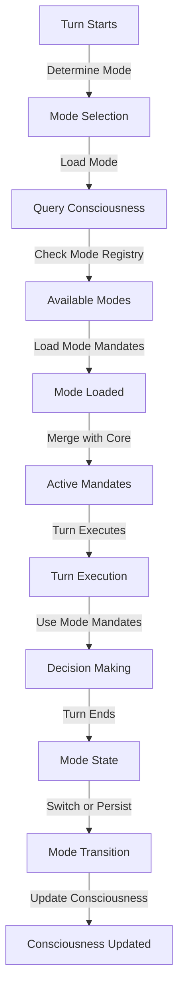

# Consciousness ↔ Consciousness Modes Integration

**Status:** Specification v1.0  
**Last Updated:** 2025-11-06  
**Priority:** MEDIUM (Identity Management)

## Overview

This integration defines how Consciousness Modes enable Si to operate under different value systems, mandates, and behavioral constraints. Modes allow Si to switch between different operational identities (e.g., "research mode", "customer service mode", "creative mode") while maintaining core safety constraints.

### Key Concepts

- **Consciousness**: Si's current values, mandates, identity, and governance rules
- **Consciousness Mode**: A named, versioned set of mandates and behavioral constraints
- **Mode Loading**: Activating a consciousness mode for a turn or session
- **Mode Switching**: Transitioning from one mode to another
- **Mode Retirement**: Deactivating a consciousness mode
- **Core Mandates**: Safety constraints that persist across all modes

## Data Flow

### ASCII Diagram

```
Turn starts
  ↓
Determine required consciousness mode
  ↓
Query Consciousness: "Load mode X"
  ↓
Consciousness loads mode
  ↓
Mode mandates become active
  ↓
Turn executes with mode mandates
  ↓
Turn ends
  ↓
Mode remains active or switches
  ↓
Consciousness updates mode state
```

### Mermaid Diagram



## API Contracts

### Load Consciousness Mode

**Request:**
```json
{
  "method": "load_mode",
  "params": {
    "mode_id": "research_mode",
    "version": "1.0",
    "turn_id": "turn_20251106_001"
  }
}
```

**Response:**
```json
{
  "status": "ok",
  "mode": {
    "mode_id": "research_mode",
    "version": "1.0",
    "name": "Research Mode",
    "description": "Optimized for deep research and analysis",
    "mandates": [
      {
        "id": "research_depth",
        "type": "mission",
        "text": "Prioritize thorough research over quick answers",
        "priority": "high"
      },
      {
        "id": "source_verification",
        "type": "safety",
        "text": "Verify all sources before citing",
        "priority": "critical"
      }
    ],
    "capabilities": ["web_search", "document_analysis", "synthesis"],
    "constraints": {
      "max_response_time_ms": 30000,
      "min_sources_required": 3
    },
    "loaded_at": "2025-11-06T10:30:00Z"
  }
}
```

### Switch Consciousness Mode

**Request:**
```json
{
  "method": "switch_mode",
  "params": {
    "from_mode_id": "research_mode",
    "to_mode_id": "customer_service_mode",
    "turn_id": "turn_20251106_002"
  }
}
```

**Response:**
```json
{
  "status": "ok",
  "switched": true,
  "from_mode": "research_mode",
  "to_mode": "customer_service_mode",
  "switched_at": "2025-11-06T10:35:00Z"
}
```

### Get Active Mode

**Request:**
```json
{
  "method": "get_active_mode",
  "params": {}
}
```

**Response:**
```json
{
  "status": "ok",
  "active_mode": {
    "mode_id": "customer_service_mode",
    "version": "1.0",
    "name": "Customer Service Mode",
    "mandates": [...],
    "capabilities": ["user_support", "issue_resolution", "escalation"],
    "loaded_at": "2025-11-06T10:35:00Z"
  }
}
```

### Retire Consciousness Mode

**Request:**
```json
{
  "method": "retire_mode",
  "params": {
    "mode_id": "research_mode"
  }
}
```

**Response:**
```json
{
  "status": "ok",
  "retired": true,
  "mode_id": "research_mode",
  "retired_at": "2025-11-06T10:40:00Z"
}
```

## Decision Points

### 1. Mode Selection
**When:** Turn starts  
**What:** Determine which consciousness mode to use  
**How:** Analyze stimulus, user context, turn goals  
**Result:** Mode ID selected

### 2. Mode Loading
**When:** Mode selected  
**What:** Load mode mandates and constraints  
**How:** Query Consciousness for mode definition  
**Result:** Mode mandates become active

### 3. Mode Switching
**When:** Turn context changes  
**What:** Switch to different consciousness mode  
**How:** Call Consciousness.switch_mode  
**Result:** New mode mandates active

### 4. Mode Retirement
**When:** Mode no longer needed  
**What:** Deactivate consciousness mode  
**How:** Call Consciousness.retire_mode  
**Result:** Mode deactivated, core mandates remain

## Concrete Examples

### Example 1: Research Mode

```
Turn 1:

User: "Research the history of AI ethics"

Frontal Cortex:
  1. Analyzes request: "This is a research task"
  2. Decides: Load research_mode
  3. Queries Consciousness: "Load research_mode"

Consciousness:
  1. Loads research_mode mandates:
     - "Prioritize thorough research over quick answers"
     - "Verify all sources before citing"
     - "Provide multiple perspectives"
  2. Loads research_mode capabilities:
     - web_search, document_analysis, synthesis
  3. Sets constraints:
     - min_sources_required: 3
     - max_response_time_ms: 30000

Executor:
  1. Executes with research_mode mandates
  2. Searches multiple sources
  3. Verifies each source
  4. Synthesizes findings
  5. Returns comprehensive research response
```

### Example 2: Mode Switching

```
Turn 1-5: Research Mode
  - User asks research questions
  - Consciousness operates in research_mode

Turn 6:

User: "I need help with a customer issue"

Frontal Cortex:
  1. Analyzes: "Context changed to customer service"
  2. Decides: Switch to customer_service_mode
  3. Calls Consciousness.switch_mode(research_mode → customer_service_mode)

Consciousness:
  1. Retires research_mode mandates
  2. Loads customer_service_mode mandates:
     - "Prioritize user satisfaction"
     - "Resolve issues quickly"
     - "Escalate when needed"
  3. Loads customer_service_mode capabilities:
     - user_support, issue_resolution, escalation

Executor:
  1. Executes with customer_service_mode mandates
  2. Focuses on quick resolution
  3. Offers escalation if needed
  4. Returns customer-focused response
```

## Error Handling

### Mode Not Found
**What:** Requested mode doesn't exist  
**How:** Return error, keep current mode active  
**Recovery:** Use default mode or ask user

### Mode Loading Failure
**What:** Mode definition can't be loaded  
**How:** Return error, keep current mode  
**Recovery:** Retry or use fallback mode

### Mode Switching Conflict
**What:** Can't switch modes due to active operations  
**How:** Queue mode switch for next turn  
**Recovery:** Complete current operations first

### Mandate Conflict
**What:** Mode mandates conflict with core mandates  
**How:** Core mandates take precedence  
**Recovery:** Log conflict, use core mandates

## Related Integrations

- **[Consciousness ↔ Frontal Cortex](consciousness-frontal-cortex.md)** - FC uses mode mandates for planning
- **[Working Memory ↔ Consciousness](working-memory-consciousness.md)** - WM queries active mode during context assembly
- **[Turn Trace ↔ System Change Proposals](turn-trace-system-change-proposals.md)** - Mode switches logged for analysis

## Alignment with Si Core Tenants

- **Documentation-as-Code:** Integration fully specified; any implementation can follow the same mode loading and switching logic
- **Tests-First:** Test conditions drive implementation of mode management
- **Modularity:** Modes are independent; new modes can be added without code changes
- **Technology-Agnosticism:** Uses generic JSON contracts for mode definitions

## Testing Considerations

### Test Scenario 1: Mode Loading
- **Setup:** Consciousness has research_mode defined
- **Expected:** Mode loads successfully
- **Acceptance Criteria:**
  - Mode mandates loaded
  - Capabilities available
  - Constraints applied

### Test Scenario 2: Mode Switching
- **Setup:** research_mode active, switch to customer_service_mode
- **Expected:** Mode switches successfully
- **Acceptance Criteria:**
  - Old mode mandates deactivated
  - New mode mandates activated
  - Transition logged

### Test Scenario 3: Core Mandates Persist
- **Setup:** Switch between modes
- **Expected:** Core safety mandates always active
- **Acceptance Criteria:**
  - Safety mandates never deactivated
  - Mode mandates override non-core mandates
  - Core mandates take precedence on conflicts

### Test Scenario 4: Mode Retirement
- **Setup:** research_mode active, retire it
- **Expected:** Mode deactivated
- **Acceptance Criteria:**
  - Mode marked as retired
  - Mode mandates no longer active
  - Core mandates remain active

