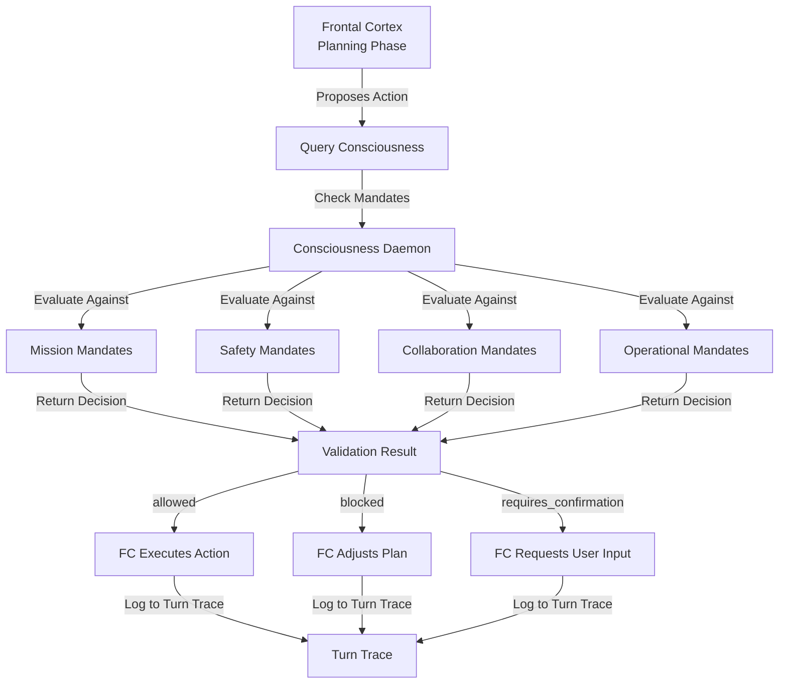

# Consciousness ↔ Frontal Cortex Integration

**Status:** Specification v1.0  
**Last Updated:** 2025-11-05  
**Priority:** HIGH (Core to decision-making)

## Overview

This integration defines how Consciousness mandates, capabilities, and governance rules guide Frontal Cortex planning and action type validation. Consciousness provides the "what we should do" constraints that Frontal Cortex uses when deciding "what we will do."

### Key Concepts

- **Consciousness**: Si's values, mandates, identity, capabilities, and governance rules
- **Frontal Cortex**: Long-horizon goals and actionable next steps
- **Action Types**: Specific types of actions FC can execute (e.g., "research", "contact_user", "execute_tool")
- **Validation**: Checking that proposed actions comply with consciousness mandates

## Data Flow

### ASCII Diagram

```
Frontal Cortex Planning
  ↓
FC proposes action type
  ↓
FC queries Consciousness: "Is this action type allowed?"
  ↓
Consciousness checks mandates
  ↓
Consciousness returns: allowed | blocked | requires_confirmation
  ↓
FC proceeds or adjusts plan
  ↓
Turn Trace logs decision
```

### Mermaid Diagram



## API Contracts

### Request: FC Queries Consciousness

```json
{
  "query": "Is this action type allowed?",
  "metadata": {
    "action_type": "contact_external_service",
    "context": "user_request",
    "urgency": "high"
  },
  "data": {
    "action_type_name": "contact_external_service",
    "description": "Contact external API to retrieve data",
    "parameters": {
      "service": "weather_api",
      "endpoint": "/forecast",
      "timeout_ms": 5000
    },
    "rationale": "User asked for weather forecast"
  }
}
```

### Response: Consciousness Returns Decision

```json
{
  "decision": "allowed",
  "rationale": "External service calls are allowed for user-requested information",
  "mandates_checked": [
    {
      "mandate_id": "safety_001",
      "mandate": "Do not contact services that could compromise user privacy",
      "status": "satisfied",
      "reason": "Weather API does not require user credentials"
    },
    {
      "mandate_id": "operational_001",
      "mandate": "Respect rate limits on external services",
      "status": "satisfied",
      "reason": "Single call within rate limits"
    }
  ],
  "confidence": 0.95,
  "timestamp": "2025-11-05T10:30:00Z"
}
```

### Response: Blocked Action

```json
{
  "decision": "blocked",
  "rationale": "This action violates safety mandate",
  "mandates_violated": [
    {
      "mandate_id": "safety_002",
      "mandate": "Do not modify user data without explicit confirmation",
      "reason": "Action would modify user preferences without confirmation"
    }
  ],
  "suggested_alternatives": [
    "Request user confirmation first",
    "Use read-only operation instead"
  ],
  "confidence": 0.99,
  "timestamp": "2025-11-05T10:30:00Z"
}
```

## Decision Points

### 1. Action Type Validation
**When:** FC proposes a new action type  
**What:** Check if action type complies with consciousness mandates  
**How:** Query consciousness with action type details  
**Result:** allowed | blocked | requires_confirmation

### 2. Parameter Validation
**When:** FC specifies parameters for an action  
**What:** Check if parameters comply with mandates  
**How:** Include parameters in consciousness query  
**Result:** Parameters approved or rejected

### 3. Urgency Consideration
**When:** High-urgency situations  
**What:** May relax some constraints  
**How:** Include urgency in query metadata  
**Result:** Different decision based on urgency level

## Concrete Examples

### Example 1: Allowed Action (Happy Path)

```
User: "What's the weather in Paris?"

FC Planning:
  1. Proposes action: "call_weather_api"
  2. Queries Consciousness: "Is calling weather_api allowed?"
  
Consciousness Response:
  - Decision: "allowed"
  - Rationale: "External API calls for user-requested info are allowed"
  - Mandates checked: safety (no privacy risk), operational (within rate limits)

FC Execution:
  1. Calls weather API
  2. Receives forecast data
  3. Logs to Turn Trace: "Action allowed by consciousness"
  4. Returns forecast to user
```

### Example 2: Blocked Action

```
User: "Delete all my previous conversations"

FC Planning:
  1. Proposes action: "delete_conversation_history"
  2. Queries Consciousness: "Is deleting conversation history allowed?"
  
Consciousness Response:
  - Decision: "blocked"
  - Rationale: "Destructive operations require explicit user confirmation"
  - Mandates violated: safety_003 (data integrity)

FC Adjustment:
  1. Recognizes action is blocked
  2. Adjusts plan: "Request user confirmation first"
  3. Asks user: "Are you sure you want to delete all conversations?"
  4. Logs to Turn Trace: "Action blocked, requesting confirmation"
```

### Example 3: Requires Confirmation

```
User: "Send an email to my boss"

FC Planning:
  1. Proposes action: "send_email"
  2. Queries Consciousness: "Is sending email allowed?"
  
Consciousness Response:
  - Decision: "requires_confirmation"
  - Rationale: "Sending communications requires user confirmation"
  - Mandates: collaboration_001 (user controls communications)

FC Execution:
  1. Recognizes confirmation is required
  2. Requests user confirmation: "Send email to boss@company.com?"
  3. Waits for user response
  4. If confirmed: sends email
  5. If denied: cancels action
  6. Logs to Turn Trace: "Action required confirmation"
```

## Error Handling

### Timeout
**What:** Consciousness query times out  
**How:** Return default decision (usually "blocked" for safety)  
**Recovery:** Log error, retry on next turn

### Missing Mandate
**What:** Consciousness doesn't have mandate for action type  
**How:** Return "requires_confirmation" (conservative)  
**Recovery:** Add mandate to consciousness, retry

### Conflicting Mandates
**What:** Multiple mandates give conflicting guidance  
**How:** Return "requires_confirmation" with explanation  
**Recovery:** Clarify mandates in consciousness

## Related Integrations

- **[Working Memory ↔ Consciousness](working-memory-consciousness.md)** - WM queries consciousness during context assembly to retrieve mandates and capabilities
- **[Scratch Page ↔ Frontal Cortex](scratch-page-frontal-cortex.md)** - FC uses observations from Scratch Page to inform planning decisions
- **[Turn Trace ↔ System Change Proposals](turn-trace-system-change-proposals.md)** - FC decisions are logged to Turn Trace for analysis and improvement proposals

## Alignment with Si Core Tenants

- **Documentation-as-Code:** This integration is fully specified as documentation, enabling any implementation to follow the same decision logic and validation rules
- **Tests-First:** Test conditions drive the implementation of consciousness validation logic and FC decision-making
- **Modularity:** Consciousness and FC are separate components with clear API contracts; changes to mandates don't require FC code changes
- **Technology-Agnosticism:** The integration uses generic JSON contracts, not tied to any specific language or framework

## Testing Considerations

### Test Scenario 1: Allowed Action (Happy Path)
- **Setup:**
  - Create consciousness with mandate: "External API calls for user-requested info are allowed"
  - FC proposes action: `{action_type: "call_weather_api", service: "weather_api", rationale: "User asked for weather"}`
- **Expected:** Consciousness returns `{decision: "allowed", confidence: 0.95}`
- **Acceptance Criteria:**
  - Decision is "allowed"
  - Confidence >= 0.9
  - Mandates checked include safety and operational mandates
  - Response time < 100ms
- **Verification Steps:**
  1. Verify decision field equals "allowed"
  2. Verify confidence score is present and >= 0.9
  3. Verify mandates_checked array contains at least 2 mandates
  4. Verify FC executes action without modification
  5. Verify Turn Trace logs: "Action allowed by consciousness"
- **Edge Cases:**
  - Multiple mandates all satisfied
  - Confidence score at boundary (0.9)
  - Action with no parameters

### Test Scenario 2: Blocked Action
- **Setup:**
  - Create consciousness with mandate: "Do not modify user data without explicit confirmation"
  - FC proposes action: `{action_type: "delete_conversation_history", rationale: "User requested"}`
- **Expected:** Consciousness returns `{decision: "blocked", confidence: 0.99}`
- **Acceptance Criteria:**
  - Decision is "blocked"
  - Confidence >= 0.95
  - Mandates_violated array is not empty
  - Suggested_alternatives array contains at least 1 alternative
- **Verification Steps:**
  1. Verify decision field equals "blocked"
  2. Verify confidence >= 0.95
  3. Verify mandates_violated contains violated mandate IDs
  4. Verify suggested_alternatives is non-empty
  5. Verify FC adjusts plan and requests confirmation
  6. Verify Turn Trace logs: "Action blocked, requesting confirmation"
- **Edge Cases:**
  - Multiple mandates violated
  - No alternatives available
  - Destructive operation on empty data

### Test Scenario 3: Requires Confirmation
- **Setup:**
  - Create consciousness with mandate: "Sending communications requires user confirmation"
  - FC proposes action: `{action_type: "send_email", recipient: "boss@company.com"}`
- **Expected:** Consciousness returns `{decision: "requires_confirmation"}`
- **Acceptance Criteria:**
  - Decision is "requires_confirmation"
  - Rationale explains why confirmation needed
  - FC requests user confirmation before proceeding
- **Verification Steps:**
  1. Verify decision field equals "requires_confirmation"
  2. Verify rationale field is present and non-empty
  3. Verify FC calls user confirmation dialog
  4. Verify action executes only if user confirms
  5. Verify action is cancelled if user denies
  6. Verify Turn Trace logs confirmation request and user response
- **Edge Cases:**
  - User timeout on confirmation dialog
  - User denies confirmation
  - Confirmation dialog appears multiple times

### Test Scenario 4: Timeout Handling
- **Setup:**
  - Configure consciousness query timeout: 100ms
  - Create slow consciousness that takes 500ms to respond
  - FC proposes action: `{action_type: "call_weather_api"}`
- **Expected:** FC receives timeout error and uses default decision
- **Acceptance Criteria:**
  - Query times out after 100ms
  - FC uses conservative default (blocked)
  - Error is logged with timestamp
  - System continues without crashing
- **Verification Steps:**
  1. Verify query times out at configured threshold
  2. Verify default decision is "blocked"
  3. Verify error log contains: query_id, timeout_ms, timestamp
  4. Verify FC handles error gracefully
  5. Verify Turn Trace logs timeout event
  6. Verify system state is consistent after timeout
- **Edge Cases:**
  - Multiple timeouts in sequence
  - Timeout during high-urgency request
  - Timeout with partial response

### Test Scenario 5: New Action Type (Unknown Mandate)
- **Setup:**
  - Create consciousness without mandate for "parallel_task" action
  - FC proposes action: `{action_type: "parallel_task", tasks: [...]}`
- **Expected:** Consciousness returns `{decision: "requires_confirmation"}`
- **Acceptance Criteria:**
  - Decision is "requires_confirmation" (conservative)
  - Rationale explains unknown action type
  - FC requests user confirmation
- **Verification Steps:**
  1. Verify decision is "requires_confirmation"
  2. Verify rationale mentions unknown action type
  3. Verify FC requests user confirmation
  4. Verify Turn Trace logs: "Unknown action type, requesting confirmation"
  5. Verify system doesn't crash on unknown action
  6. Verify new mandate can be added to consciousness
- **Edge Cases:**
  - Multiple unknown action types
  - Unknown action with high urgency
  - Unknown action with no parameters

### Test Scenario 6: Conflicting Mandates
- **Setup:**
  - Create consciousness with conflicting mandates:
    - Mandate A: "Always help users quickly"
    - Mandate B: "Always verify external services before use"
  - FC proposes action: `{action_type: "call_unverified_service", urgency: "high"}`
- **Expected:** Consciousness returns `{decision: "requires_confirmation"}`
- **Acceptance Criteria:**
  - Decision is "requires_confirmation"
  - Rationale explains conflict
  - Both conflicting mandates are listed
- **Verification Steps:**
  1. Verify decision is "requires_confirmation"
  2. Verify rationale mentions mandate conflict
  3. Verify both mandates appear in response
  4. Verify FC requests user input to resolve conflict
  5. Verify Turn Trace logs conflict details
  6. Verify system doesn't deadlock
- **Edge Cases:**
  - Three or more conflicting mandates
  - Conflict with high urgency
  - Conflict with no clear resolution

### Test Scenario 7: Parameter Validation
- **Setup:**
  - Create consciousness with mandate: "Rate limit external services to 1 call per second"
  - FC proposes action: `{action_type: "call_weather_api", rate_limit_ms: 500}`
- **Expected:** Consciousness returns `{decision: "blocked"}`
- **Acceptance Criteria:**
  - Decision is "blocked"
  - Mandates_violated includes rate limit mandate
  - Suggested_alternatives includes "increase rate_limit_ms to 1000"
- **Verification Steps:**
  1. Verify decision is "blocked"
  2. Verify rate limit mandate is in mandates_violated
  3. Verify suggested_alternatives contains rate limit fix
  4. Verify FC adjusts parameters and retries
  5. Verify Turn Trace logs parameter violation
  6. Verify corrected action is allowed
- **Edge Cases:**
  - Parameter at boundary (exactly 1000ms)
  - Multiple parameter violations
  - Parameter validation with high urgency

