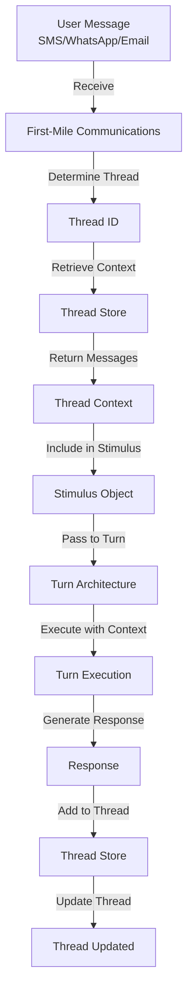

# Conversation Threads ↔ Turn Architecture Integration

**Status:** Specification v1.0  
**Last Updated:** 2025-11-05  
**Priority:** MEDIUM (Conversation Continuity)

## Overview

This integration defines how Conversation Threads provide context continuity across turns. A thread is a group of linked messages that form a coherent conversation, independent of communication channel. Threads enable Si to maintain context across multiple turns and channels.

### Key Concepts

- **Conversation Thread**: Group of linked messages forming coherent conversation
- **Thread ID**: Unique identifier for conversation thread
- **Thread Context**: Messages and metadata from thread
- **Cross-Channel**: Threads span multiple channels (SMS, WhatsApp, email, etc.)
- **Semantic Continuity**: Messages related by topic, not just time

## Data Flow

### ASCII Diagram

```
User sends message
  ↓
First-Mile Communications receives
  ↓
Determines thread ID
  ↓
Retrieves thread context
  ↓
Creates stimulus with thread context
  ↓
Turn executes with thread context
  ↓
Turn generates response
  ↓
Response added to thread
  ↓
Thread updated
```

### Mermaid Diagram



## API Contracts

### Determine Thread Request

```json
{
  "method": "determine_thread",
  "params": {
    "channel": "sms",
    "sender_id": "user_123",
    "message": "What's the weather in Paris?",
    "timestamp": "2025-11-05T10:30:00Z",
    "previous_thread_id": null
  }
}
```

### Determine Thread Response

```json
{
  "thread_id": "thread_20251105_001",
  "thread_status": "existing",
  "thread_topic": "travel_planning",
  "message_count": 5,
  "last_message_timestamp": "2025-11-05T10:25:00Z"
}
```

### Retrieve Thread Context Request

```json
{
  "method": "get_thread_context",
  "params": {
    "thread_id": "thread_20251105_001",
    "max_messages": 10,
    "include_metadata": true
  }
}
```

### Retrieve Thread Context Response

```json
{
  "thread_id": "thread_20251105_001",
  "thread_topic": "travel_planning",
  "messages": [
    {
      "message_id": "msg_001",
      "sender": "user_123",
      "content": "I want to plan a trip to Europe",
      "timestamp": "2025-11-05T09:00:00Z",
      "channel": "sms"
    },
    {
      "message_id": "msg_002",
      "sender": "si",
      "content": "Great! Where would you like to go?",
      "timestamp": "2025-11-05T09:05:00Z",
      "channel": "sms"
    },
    {
      "message_id": "msg_003",
      "sender": "user_123",
      "content": "Paris and London",
      "timestamp": "2025-11-05T10:20:00Z",
      "channel": "whatsapp"
    }
  ],
  "metadata": {
    "created_at": "2025-11-05T09:00:00Z",
    "last_updated": "2025-11-05T10:20:00Z",
    "channels": ["sms", "whatsapp"],
    "participants": ["user_123", "si"]
  }
}
```

### Add Message to Thread Request

```json
{
  "method": "add_message_to_thread",
  "params": {
    "thread_id": "thread_20251105_001",
    "message": {
      "sender": "si",
      "content": "The weather in Paris is 15°C and cloudy.",
      "timestamp": "2025-11-05T10:30:00Z",
      "channel": "sms",
      "turn_id": "turn_20251105_001"
    }
  }
}
```

## Decision Points

### 1. Thread Determination
**When:** Message received  
**What:** Determine if new thread or continuation  
**How:** Analyze message content and sender  
**Result:** Thread ID assigned

### 2. Thread Context Retrieval
**When:** Thread ID determined  
**What:** Retrieve relevant thread context  
**How:** Query thread store  
**Result:** Context retrieved

### 3. Context Injection
**When:** Creating stimulus  
**What:** Include thread context in stimulus  
**How:** Add messages and metadata  
**Result:** Stimulus includes thread context

### 4. Thread Update
**When:** Turn completes  
**What:** Add response to thread  
**How:** Store message in thread  
**Result:** Thread updated

## Concrete Examples

### Example 1: Single-Channel Thread

```
Turn 1: User sends SMS "I want to plan a trip to Europe"

First-Mile Communications:
  1. Receives SMS from user_123
  2. Calls determine_thread()
  3. No previous thread found
  4. Creates new thread: "thread_20251105_001"
  5. Calls get_thread_context()
  6. Returns empty context (new thread)
  7. Creates stimulus with thread_id

Turn Execution:
  1. Router analyzes: "Trip planning request"
  2. Executor plans: "Ask for destination preferences"
  3. Responder generates: "Great! Where would you like to go?"

First-Mile Communications:
  1. Receives response
  2. Calls add_message_to_thread()
  3. Adds Si response to thread
  4. Thread now has 2 messages

Turn 2: User sends SMS "Paris and London"

First-Mile Communications:
  1. Receives SMS from user_123
  2. Calls determine_thread()
  3. Finds existing thread: "thread_20251105_001"
  4. Calls get_thread_context()
  5. Returns previous messages:
     - "I want to plan a trip to Europe"
     - "Great! Where would you like to go?"
  6. Creates stimulus with thread context

Turn Execution:
  1. Router analyzes with context: "User wants Paris and London"
  2. Executor plans: "Get preferences for both cities"
  3. Responder generates: "Paris and London are great! What dates?"

First-Mile Communications:
  1. Adds Si response to thread
  2. Thread now has 4 messages
```

### Example 2: Cross-Channel Thread

```
Turn 1: User sends SMS "I want to plan a trip to Europe"

Thread Created: "thread_20251105_001"
  - Message 1: SMS from user_123 "I want to plan a trip to Europe"
  - Message 2: SMS from Si "Great! Where would you like to go?"

Turn 2: User sends WhatsApp "Paris and London"

First-Mile Communications:
  1. Receives WhatsApp from user_123
  2. Calls determine_thread()
  3. Finds existing thread: "thread_20251105_001"
  4. Calls get_thread_context()
  5. Returns all previous messages (from SMS)
  6. Creates stimulus with thread context

Turn Execution:
  1. Router analyzes with context: "User wants Paris and London"
  2. Executor plans: "Get preferences for both cities"
  3. Responder generates: "Paris and London are great! What dates?"

First-Mile Communications:
  1. Adds Si response to thread
  2. Thread now has 4 messages across 2 channels

Turn 3: User sends Email "I prefer spring"

First-Mile Communications:
  1. Receives Email from user_123
  2. Calls determine_thread()
  3. Finds existing thread: "thread_20251105_001"
  4. Calls get_thread_context()
  5. Returns all previous messages (from SMS and WhatsApp)
  6. Creates stimulus with thread context

Turn Execution:
  1. Router analyzes with context: "User prefers spring, wants Paris and London"
  2. Executor plans: "Create spring itinerary"
  3. Responder generates: "Spring is perfect! Here's a suggested itinerary..."

Thread Now Has:
  - SMS messages (2)
  - WhatsApp messages (2)
  - Email messages (2)
  - All linked in single thread
```

### Example 3: Implicit Channel Thread Linking

```
Turn 1: User sends SMS "What's the weather in Paris?"

Thread Created: "thread_weather_paris"
  - Message 1: SMS "What's the weather in Paris?"
  - Message 2: SMS "The weather in Paris is 15°C and cloudy."

30 minutes pass (inactivity)

Turn 2: User sends SMS "What about London?"

First-Mile Communications:
  1. Receives SMS from user_123
  2. Calls determine_thread()
  3. Analyzes: "Message about weather, similar to previous"
  4. Checks for semantic continuity: "Weather topic"
  5. Finds previous thread: "thread_weather_paris"
  6. Determines: "Likely continuation of weather conversation"
  7. Calls get_thread_context()
  8. Returns previous weather messages
  9. Creates stimulus with thread context

Turn Execution:
  1. Router analyzes with context: "User asking about London weather"
  2. Executor plans: "Get London weather"
  3. Responder generates: "The weather in London is 12°C and rainy."

Thread Updated:
  - Message 1: SMS "What's the weather in Paris?"
  - Message 2: SMS "The weather in Paris is 15°C and cloudy."
  - Message 3: SMS "What about London?"
  - Message 4: SMS "The weather in London is 12°C and rainy."
```

## Error Handling

### Thread Not Found
**What:** Cannot find thread for message  
**How:** Create new thread  
**Recovery:** Continue with new thread

### Thread Context Retrieval Failure
**What:** Cannot retrieve thread context  
**How:** Continue without context  
**Recovery:** Retry on next turn

### Thread Update Failure
**What:** Cannot add message to thread  
**How:** Log error, continue  
**Recovery:** Retry on next turn

### Semantic Continuity Detection Failure
**What:** Cannot determine if message continues thread  
**How:** Create new thread  
**Recovery:** User can reference previous thread if needed

## Related Integrations

- **[First-Mile Communications ↔ Turn Architecture](first-mile-communications-turn.md)** - Channels provide messages to threads
- **[Working Memory ↔ Frontal Cortex](working-memory-frontal-cortex.md)** - Thread context injected into memory

## Alignment with Si Core Tenants

- **Documentation-as-Code:** Integration fully specified; any implementation can follow the same thread linking logic
- **Tests-First:** Test conditions drive implementation of thread creation and semantic linking
- **Modularity:** Threads are independent; thread changes don't require channel code changes
- **Technology-Agnosticism:** Uses generic message format, not tied to specific channel technology

## Testing Considerations

### Test Scenario 1: Single-Channel Thread Creation
- **Setup:**
  - Message 1 (SMS): "What's the weather?"
  - Message 2 (SMS): "In Paris?"
  - Message 3 (SMS): "For tomorrow?"
  - All from same sender, same channel
- **Expected:** New thread created
- **Acceptance Criteria:**
  - Thread created with unique thread_id
  - All 3 messages linked to thread
  - Messages in chronological order
  - Thread status is "active"
- **Verification Steps:**
  1. Verify thread_id is unique
  2. Verify thread.message_count equals 3
  3. Verify all messages have same thread_id
  4. Verify messages in chronological order
  5. Verify thread.channel equals "sms"
  6. Verify Turn Trace logs thread creation
- **Edge Cases:**
  - Single message thread
  - 100+ message thread
  - Messages with same timestamp

### Test Scenario 2: Thread Continuation
- **Setup:**
  - Thread exists with 2 messages
  - Send new message: "What about tomorrow?"
  - Message should be added to existing thread
- **Expected:** Message added to thread
- **Acceptance Criteria:**
  - Message added to existing thread
  - Thread.message_count increases to 3
  - Thread context includes all messages
  - Message in correct chronological position
- **Verification Steps:**
  1. Verify thread.message_count equals 3
  2. Verify new message has same thread_id
  3. Verify thread context includes all 3 messages
  4. Verify messages in chronological order
  5. Verify thread.updated_at is recent
  6. Verify Turn Trace logs message addition
- **Edge Cases:**
  - Message added after long gap
  - Message added out of order (timestamp)
  - Message added to archived thread

### Test Scenario 3: Cross-Channel Thread
- **Setup:**
  - Message 1 (SMS): "Can you help with wine?"
  - Message 2 (WhatsApp): "I prefer Burgundy"
  - Message 3 (Email): "What's your recommendation?"
  - All from same user, semantically related
- **Expected:** All messages in same thread
- **Acceptance Criteria:**
  - Thread created with unique thread_id
  - All 3 messages linked to thread
  - Thread includes messages from 3 channels
  - Thread status is "active"
- **Verification Steps:**
  1. Verify thread_id is unique
  2. Verify thread.message_count equals 3
  3. Verify all messages have same thread_id
  4. Verify thread.channels includes: ["sms", "whatsapp", "email"]
  5. Verify messages in chronological order
  6. Verify Turn Trace logs cross-channel linking
- **Edge Cases:**
  - Messages from 5+ channels
  - Messages with large time gaps
  - Messages from different users

### Test Scenario 4: Thread Context Retrieval
- **Setup:**
  - Thread contains 5 messages
  - Query: `get_thread_context(thread_id)`
- **Expected:** All messages returned
- **Acceptance Criteria:**
  - All 5 messages returned
  - Messages in chronological order
  - Context complete and accurate
- **Verification Steps:**
  1. Verify query returns exactly 5 messages
  2. Verify messages in chronological order
  3. Verify all message content present
  4. Verify all message metadata present
  5. Verify query time < 100ms
  6. Verify Turn Trace logs query
- **Edge Cases:**
  - Thread with 1 message
  - Thread with 100+ messages
  - Query with missing thread_id

### Test Scenario 5: Semantic Continuity Linking
- **Setup:**
  - Message 1: "I'm planning a trip to Paris"
  - 2-hour gap (no messages)
  - Message 2: "What's the best wine region near Paris?"
  - System detects semantic continuity
- **Expected:** Message linked to previous thread
- **Acceptance Criteria:**
  - Message added to existing thread
  - Semantic linking detected
  - Thread.linking_type includes "semantic"
  - Thread context available
- **Verification Steps:**
  1. Verify message added to existing thread
  2. Verify thread.message_count equals 2
  3. Verify thread.linking_type equals "semantic"
  4. Verify thread.semantic_score >= 0.8
  5. Verify thread context includes both messages
  6. Verify Turn Trace logs semantic linking
- **Edge Cases:**
  - Low semantic similarity (0.5)
  - High semantic similarity (0.99)
  - Messages with no semantic relation

### Test Scenario 6: Multiple Threads Isolation
- **Setup:**
  - Thread 1: Messages about weather
  - Thread 2: Messages about wine
  - Query Thread 1
- **Expected:** Threads kept separate
- **Acceptance Criteria:**
  - Thread 1 query returns only weather messages
  - Thread 2 messages not in Thread 1
  - No cross-thread contamination
- **Verification Steps:**
  1. Verify Thread 1 query returns only weather messages
  2. Verify Thread 1.message_count equals 3
  3. Verify Thread 2 messages not in Thread 1
  4. Verify Thread 2 query returns only wine messages
  5. Verify Thread 2.message_count equals 2
  6. Verify Turn Trace logs both threads
- **Edge Cases:**
  - Threads with overlapping keywords
  - Threads with same sender
  - Threads with same time period

### Test Scenario 7: Thread Metadata Accuracy
- **Setup:**
  - Create thread with 3 messages from 2 channels
  - Messages from 2 participants
  - Spanning 1 hour
- **Expected:** Metadata updated
- **Acceptance Criteria:**
  - Metadata includes all channels
  - Metadata includes all participants
  - Timestamps accurate
  - Message count accurate
- **Verification Steps:**
  1. Verify thread.channels includes both channels
  2. Verify thread.participants includes both users
  3. Verify thread.created_at is accurate
  4. Verify thread.updated_at is recent
  5. Verify thread.message_count equals 3
  6. Verify thread.time_span_minutes equals 60
- **Edge Cases:**
  - Thread with 1 participant
  - Thread with 10+ participants
  - Thread spanning multiple days

