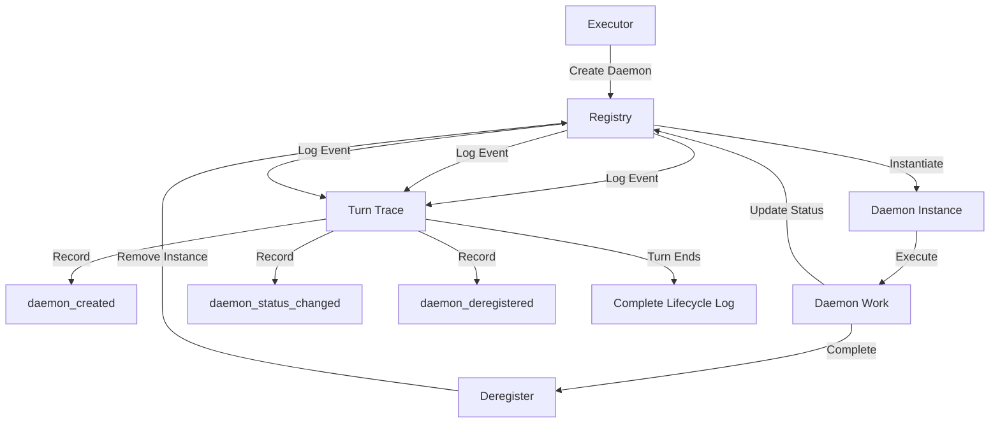

# Daemon Registry ↔ Turn Trace Integration

**Status:** Specification v1.0  
**Last Updated:** 2025-11-06  
**Priority:** MEDIUM (Observability)

## Overview

This integration defines how the Daemon Registry reports daemon lifecycle events to the Turn Trace for observability and debugging. Every daemon creation, status change, and deregistration is logged to enable comprehensive turn analysis and system improvement proposals.

### Key Concepts

- **Daemon Registry**: Tracks daemon types and instances
- **Turn Trace**: Immutable audit log of all turn events
- **Daemon Lifecycle Event**: Creation, status update, or deregistration of a daemon
- **Observability**: Ability to understand what daemons did during a turn
- **Debugging**: Using daemon events to diagnose issues

## Data Flow

### ASCII Diagram

```
Executor creates daemon
  ↓
Registry instantiates daemon
  ↓
Registry logs to Turn Trace: "daemon_created"
  ↓
Daemon executes
  ↓
Executor updates daemon status
  ↓
Registry logs to Turn Trace: "daemon_status_changed"
  ↓
Daemon completes
  ↓
Executor deregisters daemon
  ↓
Registry logs to Turn Trace: "daemon_deregistered"
  ↓
Turn ends
  ↓
Turn Trace contains complete daemon lifecycle
```

### Mermaid Diagram



## API Contracts

### Daemon Created Event

**Logged to Turn Trace:**
```json
{
  "event_type": "daemon_created",
  "timestamp": "2025-11-06T10:30:00Z",
  "daemon_instance": {
    "instance_id": "daemon_router_001",
    "daemon_type": "router",
    "turn_id": "turn_20251106_001",
    "created_at": "2025-11-06T10:30:00Z",
    "config": {
      "timeout_ms": 5000,
      "confidence_threshold": 0.8
    }
  },
  "created_by": "executor_daemon_001"
}
```

### Daemon Status Changed Event

**Logged to Turn Trace:**
```json
{
  "event_type": "daemon_status_changed",
  "timestamp": "2025-11-06T10:30:05Z",
  "daemon_instance_id": "daemon_router_001",
  "status_transition": {
    "from": "created",
    "to": "running"
  },
  "resource_usage": {
    "tokens_used": 150,
    "time_ms": 500,
    "memory_mb": 25
  },
  "last_heartbeat": "2025-11-06T10:30:05Z"
}
```

### Daemon Deregistered Event

**Logged to Turn Trace:**
```json
{
  "event_type": "daemon_deregistered",
  "timestamp": "2025-11-06T10:30:10Z",
  "daemon_instance_id": "daemon_router_001",
  "daemon_type": "router",
  "final_status": "completed",
  "total_resource_usage": {
    "tokens_used": 450,
    "time_ms": 10000,
    "memory_mb": 50
  },
  "deregistered_by": "executor_daemon_001"
}
```

### Daemon Error Event

**Logged to Turn Trace:**
```json
{
  "event_type": "daemon_error",
  "timestamp": "2025-11-06T10:30:15Z",
  "daemon_instance_id": "daemon_executor_001",
  "daemon_type": "executor",
  "error": {
    "type": "timeout",
    "message": "Daemon execution exceeded timeout",
    "timeout_ms": 30000
  },
  "recovery_action": "retry_with_simpler_plan"
}
```

## Decision Points

### 1. Event Logging
**When:** Daemon lifecycle event occurs  
**What:** Log event to Turn Trace  
**How:** Registry calls Turn Trace.log_event  
**Result:** Event recorded in immutable log

### 2. Resource Tracking
**When:** Daemon status updates  
**What:** Track resource consumption  
**How:** Record tokens, time, memory in event  
**Result:** Resource usage visible in Turn Trace

### 3. Error Recording
**When:** Daemon encounters error  
**What:** Log error with context  
**How:** Record error type, message, recovery action  
**Result:** Error visible for debugging

### 4. Lifecycle Completion
**When:** Turn ends  
**What:** Verify all daemons deregistered  
**How:** Check Turn Trace for deregistration events  
**Result:** Complete lifecycle visible

## Concrete Examples

### Example 1: Successful Daemon Lifecycle

```
Turn 1:

10:30:00 - Executor creates Router daemon
  Turn Trace logs: daemon_created
  - instance_id: daemon_router_001
  - daemon_type: router
  - created_by: executor_daemon_001

10:30:01 - Router daemon starts executing
  Turn Trace logs: daemon_status_changed
  - from: created → running
  - tokens_used: 50

10:30:05 - Router daemon completes
  Turn Trace logs: daemon_status_changed
  - from: running → completed
  - tokens_used: 150 (total)
  - time_ms: 5000

10:30:06 - Executor deregisters Router daemon
  Turn Trace logs: daemon_deregistered
  - instance_id: daemon_router_001
  - final_status: completed
  - total_tokens_used: 150

Turn Trace now contains complete lifecycle of Router daemon
```

### Example 2: Daemon Error and Recovery

```
Turn 2:

10:35:00 - Executor creates Executor daemon
  Turn Trace logs: daemon_created
  - instance_id: daemon_executor_001
  - daemon_type: executor

10:35:05 - Executor daemon times out
  Turn Trace logs: daemon_error
  - error_type: timeout
  - timeout_ms: 30000
  - recovery_action: retry_with_simpler_plan

10:35:06 - Executor daemon retries with simpler plan
  Turn Trace logs: daemon_status_changed
  - from: error → running
  - retry_count: 1

10:35:15 - Executor daemon completes successfully
  Turn Trace logs: daemon_status_changed
  - from: running → completed
  - total_tokens_used: 800

Turn Trace shows error, recovery, and eventual success
```

### Example 3: Multiple Daemons

```
Turn 3:

10:40:00 - Executor creates 3 daemons in parallel
  Turn Trace logs:
  - daemon_created: daemon_router_001
  - daemon_created: daemon_context_assembler_001
  - daemon_created: daemon_constraint_checker_001

10:40:02 - Router completes
  Turn Trace logs: daemon_deregistered (daemon_router_001)

10:40:05 - Context Assembler completes
  Turn Trace logs: daemon_deregistered (daemon_context_assembler_001)

10:40:08 - Constraint Checker completes
  Turn Trace logs: daemon_deregistered (daemon_constraint_checker_001)

Turn Trace shows parallel execution and completion order
```

## Error Handling

### Event Logging Failure
**What:** Turn Trace logging fails  
**How:** Log error, continue daemon execution  
**Recovery:** Retry logging on next status update

### Resource Tracking Failure
**What:** Can't measure resource usage  
**How:** Log event without resource data  
**Recovery:** Use default estimates

### Deregistration Logging Failure
**What:** Deregistration event fails to log  
**How:** Mark daemon as orphaned  
**Recovery:** Log cleanup event on next turn

### Turn Trace Full
**What:** Turn Trace reaches capacity  
**How:** Summarize old events, continue logging  
**Recovery:** Archive old turns

## Related Integrations

- **[Executor ↔ Daemon Registry](executor-daemon-registry.md)** - Executor creates daemons that are logged
- **[Turn Trace ↔ System Change Proposals](turn-trace-system-change-proposals.md)** - Daemon events inform improvement proposals
- **[Daemons ↔ Scratch Page](daemons-scratch-page.md)** - Daemon observations also logged to Turn Trace

## Alignment with Si Core Tenants

- **Documentation-as-Code:** Integration fully specified; any implementation can follow the same logging pattern
- **Tests-First:** Test conditions drive implementation of daemon event logging
- **Modularity:** Registry and Turn Trace are separate; logging doesn't affect daemon execution
- **Technology-Agnosticism:** Uses generic JSON event format

## Testing Considerations

### Test Scenario 1: Daemon Creation Logging
- **Setup:** Executor creates daemon
- **Expected:** daemon_created event logged
- **Acceptance Criteria:**
  - Event logged immediately
  - All daemon info captured
  - Timestamp accurate
  - created_by field set

### Test Scenario 2: Status Change Logging
- **Setup:** Daemon status changes
- **Expected:** daemon_status_changed event logged
- **Acceptance Criteria:**
  - Status transition recorded
  - Resource usage captured
  - Timestamp accurate
  - Heartbeat updated

### Test Scenario 3: Error Logging
- **Setup:** Daemon encounters error
- **Expected:** daemon_error event logged
- **Acceptance Criteria:**
  - Error type recorded
  - Error message captured
  - Recovery action logged
  - Timestamp accurate

### Test Scenario 4: Complete Lifecycle
- **Setup:** Daemon created, executes, completes
- **Expected:** All events logged in order
- **Acceptance Criteria:**
  - daemon_created logged first
  - daemon_status_changed logged during execution
  - daemon_deregistered logged last
  - Events in chronological order
  - No events missing

