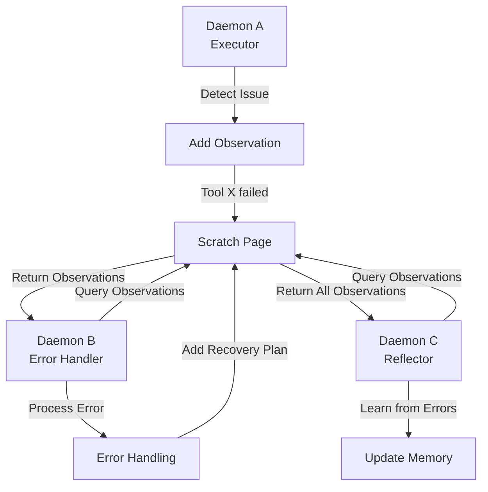

# Daemons ↔ Scratch Page Integration

**Status:** Specification v1.0  
**Last Updated:** 2025-11-05  
**Priority:** MEDIUM (Cross-Daemon Communication)

## Overview

This integration defines how daemons add observations to the Scratch Page and query observations from other daemons. The Scratch Page enables asynchronous communication between daemons within a turn and across turns.

### Key Concepts

- **Daemon**: Internal cognitive component (Router, Executor, Error Handler, etc.)
- **Scratch Page**: Shared transient storage for observations
- **Observation**: Insight or alert from daemon processing
- **Cross-Daemon Communication**: Daemons communicate via Scratch Page
- **Asynchronous**: Daemons don't wait for each other

## Data Flow

### ASCII Diagram

```
Daemon A executes
  ↓
Daemon A detects insight
  ↓
Daemon A adds observation to Scratch Page
  ↓
Daemon B queries Scratch Page
  ↓
Daemon B receives observation
  ↓
Daemon B uses observation in decision
  ↓
Daemon B may add new observation
  ↓
Daemon C queries Scratch Page
  ↓
Daemon C sees observations from A and B
```

### Mermaid Diagram



## API Contracts

### Daemon Adds Observation

```json
{
  "method": "add_observation",
  "params": {
    "type": "error_alert",
    "content": "Tool 'weather_api' failed with timeout",
    "confidence": 0.99,
    "tags": ["error", "weather_api", "timeout"],
    "source": {
      "daemon": "executor",
      "turn_id": "turn_20251105_001"
    },
    "ttl_minutes": 60
  }
}
```

### Daemon Queries Observations

```json
{
  "method": "query_observations",
  "params": {
    "query": "What errors occurred in this turn?",
    "metadata": {
      "tags": ["error"],
      "status": "active",
      "min_confidence": 0.8
    }
  }
}
```

### Response: Observations

```json
{
  "observations": [
    {
      "observation_id": "obs_20251105_001",
      "type": "error_alert",
      "content": "Tool 'weather_api' failed with timeout",
      "confidence": 0.99,
      "tags": ["error", "weather_api", "timeout"],
      "source": {
        "daemon": "executor",
        "turn_id": "turn_20251105_001"
      },
      "created_at": "2025-11-05T10:30:00Z"
    }
  ],
  "total_count": 1
}
```

## Decision Points

### 1. Observation Creation
**When:** Daemon detects issue or insight  
**What:** Determine if observation should be shared  
**How:** Evaluate relevance to other daemons  
**Result:** Observation created | Kept private

### 2. Observation Query
**When:** Daemon needs information from other daemons  
**What:** Determine what to query  
**How:** Analyze current task and context  
**Result:** Query executed, observations returned

### 3. Observation Interpretation
**When:** Daemon receives observations  
**What:** Interpret observations for decision-making  
**How:** Analyze confidence and relevance  
**Result:** Observations inform decision

## Concrete Examples

### Example 1: Error Detection and Recovery

```
Turn 1:

Executor Daemon:
  1. Attempts to call weather_api
  2. API times out
  3. Adds observation:
     - type: "error_alert"
     - content: "weather_api timeout"
     - confidence: 0.99
     - tags: ["error", "weather_api"]
  4. Continues execution

Error Handler Daemon:
  1. Queries Scratch Page: "What errors occurred?"
  2. Receives observation: "weather_api timeout"
  3. Evaluates: "This is a timeout, can retry"
  4. Adds observation:
     - type: "recovery_plan"
     - content: "Retry weather_api with longer timeout"
     - confidence: 0.85
  5. Executes recovery plan

Reflector Daemon:
  1. Queries Scratch Page: "What happened in this turn?"
  2. Receives observations:
     - "weather_api timeout"
     - "Retry with longer timeout"
  3. Learns: "weather_api sometimes times out, need longer timeout"
  4. Updates semantic memory with lesson
```

### Example 2: Cross-Daemon Coordination

```
Turn 1:

Router Daemon:
  1. Analyzes input: "User asked for weather in 5 cities"
  2. Evaluates urgency: "HIGH"
  3. Adds observation:
     - type: "routing_decision"
     - content: "High urgency, multi-city query"
     - confidence: 0.95
     - tags: ["urgency", "routing"]

Executor Daemon:
  1. Queries Scratch Page: "What routing decisions were made?"
  2. Receives observation: "High urgency, multi-city query"
  3. Evaluates: "Need to optimize for speed"
  4. Plans: "Parallel API calls for all 5 cities"
  5. Adds observation:
     - type: "execution_plan"
     - content: "Executing parallel API calls"
     - confidence: 0.9

Evaluator Daemon:
  1. Queries Scratch Page: "What was the execution plan?"
  2. Receives observation: "Parallel API calls"
  3. Evaluates: "Plan was executed successfully"
  4. Adds observation:
     - type: "evaluation_result"
     - content: "Parallel execution completed in 500ms"
     - confidence: 0.99
```

### Example 3: Daemon-to-Daemon Alert

```
Turn 1:

Executor Daemon:
  1. Detects: "User data access attempt"
  2. Adds observation:
     - type: "security_alert"
     - content: "Accessing user profile data"
     - confidence: 0.99
     - tags: ["security", "user_data"]

Executor Daemon (continued):
  1. Queries Scratch Page: "What security alerts?"
  2. Receives observation: "Accessing user profile data"
  3. Checks consciousness: "Is this allowed?"
  4. Consciousness: "Yes, allowed with user consent"
  5. Adds observation:
     - type: "constraint_check"
     - content: "User data access approved"
     - confidence: 0.99
  6. Proceeds with data access
```

## Error Handling

### Observation Storage Failure
**What:** Scratch Page storage fails  
**How:** Log error, continue daemon execution  
**Recovery:** Retry on next turn

### Query Timeout
**What:** Observation query times out  
**How:** Return empty list or partial results  
**Recovery:** Retry with simpler query

### Conflicting Observations
**What:** Multiple observations contradict  
**How:** Return all observations, let daemon decide  
**Recovery:** Log conflict for analysis

### Observation Expiration
**What:** Observation expires during turn  
**How:** Remove from Scratch Page  
**Recovery:** Daemon should handle missing observation

## Related Integrations

- **[Tools ↔ Scratch Page](tools-scratch-page.md)** - Tools also add observations to Scratch Page
- **[Scratch Page ↔ Frontal Cortex](scratch-page-frontal-cortex.md)** - Observations inform FC planning
- **[Working Memory ↔ Frontal Cortex](working-memory-frontal-cortex.md)** - Observations inform context assembly

## Alignment with Si Core Tenants

- **Documentation-as-Code:** Integration fully specified; any implementation can follow the same daemon communication logic
- **Tests-First:** Test conditions drive implementation of daemon observation sharing and querying
- **Modularity:** Daemons are independent; communication via Scratch Page doesn't create tight coupling
- **Technology-Agnosticism:** Uses generic JSON observation format for daemon communication

## Testing Considerations

### Test Scenario 1: Daemon Adds Observation
- **Setup:**
  - Executor Daemon detects: "Tool X failed with timeout"
  - Daemon calls: `add_observation({type: "error_alert", content: "Tool X failed with timeout", confidence: 0.99, tags: ["error", "tool_x"]})`
- **Expected:** Observation stored in Scratch Page
- **Acceptance Criteria:**
  - Observation created with unique observation_id
  - Observation stored in Scratch Page
  - All fields present and valid
  - Timestamp is accurate
- **Verification Steps:**
  1. Verify observation_id is unique
  2. Verify observation appears in Scratch Page
  3. Verify observation.type equals "error_alert"
  4. Verify observation.content is non-empty
  5. Verify observation.confidence equals 0.99
  6. Verify observation.tags includes "error"
- **Edge Cases:**
  - Observation with no tags
  - Observation with very long content
  - Observation with special characters

### Test Scenario 2: Daemon Queries Observations
- **Setup:**
  - Error Handler Daemon queries: `query_observations({query: "What errors occurred?", metadata: {tags: ["error"], status: "active"}})`
  - Scratch Page contains 3 error observations
- **Expected:** Error Handler receives all error observations
- **Acceptance Criteria:**
  - Query returns 3 observations
  - All returned observations have "error" tag
  - Query results include all required fields
- **Verification Steps:**
  1. Verify query returns exactly 3 results
  2. Verify all results have "error" tag
  3. Verify results include: observation_id, content, confidence, tags
  4. Verify query time < 50ms
  5. Verify Turn Trace logs query
  6. Verify query doesn't modify observations
- **Edge Cases:**
  - Query with no matching observations
  - Query with multiple tags
  - Query with empty tag list

### Test Scenario 3: Cross-Daemon Communication
- **Setup:**
  - Executor Daemon adds: `{type: "error_alert", content: "Tool X failed", tags: ["error", "tool_x"]}`
  - Error Handler Daemon queries: `{tags: ["error"]}`
- **Expected:** Error Handler receives observation from Executor
- **Acceptance Criteria:**
  - Observation created by Executor
  - Observation queryable by Error Handler
  - Communication works without coupling
- **Verification Steps:**
  1. Verify Executor adds observation
  2. Verify observation appears in Scratch Page
  3. Verify Error Handler can query it
  4. Verify Error Handler receives correct observation
  5. Verify Turn Trace logs communication
  6. Verify daemons don't directly reference each other
- **Edge Cases:**
  - Observation expires before query
  - Query before observation added
  - Multiple daemons querying same observation

### Test Scenario 4: Multiple Daemons Adding Observations
- **Setup:**
  - Executor Daemon adds: `{type: "error_alert", content: "Tool failed"}`
  - Router Daemon adds: `{type: "routing_decision", content: "High urgency"}`
  - Reflector Daemon adds: `{type: "learning", content: "Lesson learned"}`
- **Expected:** All observations stored
- **Acceptance Criteria:**
  - All 3 observations stored
  - Each has unique observation_id
  - All queryable
- **Verification Steps:**
  1. Verify 3 observations created
  2. Verify each has unique observation_id
  3. Verify all appear in Scratch Page
  4. Verify all queryable
  5. Verify Turn Trace logs all 3
  6. Verify no observations lost
- **Edge Cases:**
  - Daemons add simultaneously
  - Daemons add 100+ observations
  - Duplicate observations from different daemons

### Test Scenario 5: Observation Filtering by Tag
- **Setup:**
  - Scratch Page contains:
    - Obs 1: tags: ["error", "tool_x"]
    - Obs 2: tags: ["error", "tool_y"]
    - Obs 3: tags: ["routing", "decision"]
  - Query: `{tags: ["error"]}`
- **Expected:** Only error observations returned
- **Acceptance Criteria:**
  - Query returns 2 observations
  - Query excludes observation 3
  - Filtering works correctly
- **Verification Steps:**
  1. Verify query returns exactly 2 results
  2. Verify both results have "error" tag
  3. Verify observation 3 not in results
  4. Verify query time < 50ms
  5. Verify Turn Trace logs query
  6. Verify filtering doesn't modify observations
- **Edge Cases:**
  - Query with multiple tags (AND logic)
  - Query with no matching tags
  - Observation with no tags

### Test Scenario 6: Observation Expiration
- **Setup:**
  - Executor Daemon adds: `{content: "...", ttl_minutes: 1}`
  - Wait 61 seconds
  - Error Handler queries
- **Expected:** Observation expires and is removed
- **Acceptance Criteria:**
  - Observation queryable before TTL
  - Observation not queryable after TTL
  - Expiration logged
- **Verification Steps:**
  1. Verify observation queryable at T=0
  2. Verify observation queryable at T=30s
  3. Wait until T=61s
  4. Verify observation not queryable
  5. Verify Turn Trace logs expiration
  6. Verify expires_at timestamp is accurate
- **Edge Cases:**
  - TTL of 0 (immediate expiration)
  - TTL of 10080 (7 days)
  - Query exactly at TTL boundary

### Test Scenario 7: Concurrent Daemon Queries
- **Setup:**
  - Scratch Page contains 5 observations
  - Router Daemon queries simultaneously
  - Executor Daemon queries simultaneously
  - Error Handler Daemon queries simultaneously
- **Expected:** All queries succeed without race conditions
- **Acceptance Criteria:**
  - All 3 queries complete successfully
  - All queries return correct results
  - No data corruption
  - No deadlocks
- **Verification Steps:**
  1. Verify all 3 queries execute
  2. Verify each query returns correct results
  3. Verify query times are reasonable
  4. Verify no race conditions detected
  5. Verify Turn Trace logs all queries
  6. Verify Scratch Page integrity maintained
- **Edge Cases:**
  - Query during observation addition
  - Query during observation expiration
  - 10+ concurrent queries

