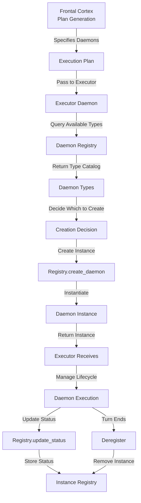

# Executor ↔ Daemon Registry Integration

**Status:** Specification v1.0  
**Last Updated:** 2025-11-06  
**Priority:** HIGH (Daemon Orchestration)

## Overview

This integration defines how the Executor daemon discovers available daemon types, creates daemon instances, and manages daemon lifecycle through the Daemon Registry. The registry provides informational services; the Executor makes all orchestration decisions based on the plan generated by Frontal Cortex.

### Key Concepts

- **Executor**: Daemon that orchestrates turn execution by creating and managing other daemons
- **Daemon Registry**: Informational system tracking daemon types and instances
- **Daemon Type**: Fixed, code-defined daemon implementation (e.g., Router, Error Handler, Reflector)
- **Daemon Instance**: Runtime instantiation of a daemon type with unique ID and state
- **Turn Scoping**: Daemons created for a turn are isolated to that turn
- **Executor Hierarchy**: Executors form a tree based on boss/recruited relationships

## Data Flow

### ASCII Diagram

```
Frontal Cortex generates plan
  ↓
Plan specifies daemon types needed
  ↓
Executor queries Registry: "List available daemon types"
  ↓
Registry returns daemon type catalog
  ↓
Executor decides which daemons to create
  ↓
Executor calls Registry: "Create daemon instance"
  ↓
Registry instantiates daemon
  ↓
Registry returns daemon instance
  ↓
Executor manages daemon lifecycle
  ↓
Executor updates Registry: "Daemon status changed"
  ↓
Turn ends
  ↓
Executor deregisters daemons
```

### Mermaid Diagram



## API Contracts

### Query Available Daemon Types

**Request:**
```json
{
  "method": "list_daemon_types",
  "params": {}
}
```

**Response:**
```json
{
  "status": "ok",
  "daemon_types": [
    {
      "type_id": "router",
      "name": "Router Daemon",
      "purpose": "Decide if quick answer is possible or plan generation needed",
      "version": "1.0",
      "required_params": [],
      "optional_params": ["timeout_ms", "confidence_threshold"]
    },
    {
      "type_id": "executor",
      "name": "Executor Daemon",
      "purpose": "Orchestrate turn execution by creating and managing daemons",
      "version": "1.0",
      "required_params": ["plan"],
      "optional_params": ["timeout_ms", "max_parallel_daemons"]
    },
    {
      "type_id": "blank_agent",
      "name": "Blank Agent Daemon",
      "purpose": "Flexible daemon that executes custom prompts",
      "version": "1.0",
      "required_params": ["prompt"],
      "optional_params": ["context", "tools"]
    }
  ]
}
```

### Create Daemon Instance

**Request:**
```json
{
  "method": "create_daemon",
  "params": {
    "daemon_type": "router",
    "turn_id": "turn_20251106_001",
    "instance_id": "daemon_router_001",
    "config": {
      "timeout_ms": 5000,
      "confidence_threshold": 0.8
    }
  }
}
```

**Response:**
```json
{
  "status": "ok",
  "daemon_instance": {
    "instance_id": "daemon_router_001",
    "daemon_type": "router",
    "turn_id": "turn_20251106_001",
    "status": "created",
    "created_at": "2025-11-06T10:30:00Z",
    "config": {
      "timeout_ms": 5000,
      "confidence_threshold": 0.8
    }
  }
}
```

### Update Daemon Status

**Request:**
```json
{
  "method": "update_daemon_status",
  "params": {
    "instance_id": "daemon_router_001",
    "status": "running",
    "last_heartbeat": "2025-11-06T10:30:05Z",
    "resource_usage": {
      "tokens_used": 150,
      "time_ms": 500
    }
  }
}
```

**Response:**
```json
{
  "status": "ok",
  "updated": true
}
```

### Deregister Daemon Instance

**Request:**
```json
{
  "method": "deregister_daemon",
  "params": {
    "instance_id": "daemon_router_001"
  }
}
```

**Response:**
```json
{
  "status": "ok",
  "deregistered": true
}
```

## Decision Points

### 1. Daemon Type Selection
**When:** Executor receives plan from FC  
**What:** Decide which daemon types to instantiate  
**How:** Executor analyzes plan and selects appropriate types  
**Result:** List of daemon types to create

### 2. Instance Creation
**When:** Daemon type selected  
**What:** Create daemon instance  
**How:** Call Registry.create_daemon with type and config  
**Result:** Daemon instance created and returned

### 3. Lifecycle Management
**When:** Daemon executes  
**What:** Track daemon status and resource usage  
**How:** Call Registry.update_status periodically  
**Result:** Registry has current daemon state

### 4. Deregistration
**When:** Turn ends or daemon completes  
**What:** Remove daemon from registry  
**How:** Call Registry.deregister_daemon  
**Result:** Daemon removed from active instances

## Concrete Examples

### Example 1: Simple Turn Execution

```
Turn 1:

Frontal Cortex:
  1. Generates plan: "Route → Execute → Reflect"
  2. Specifies daemons: [Router, Executor, Reflector]

Executor:
  1. Queries Registry: "List daemon types"
  2. Receives: [Router, Executor, Reflector, Blank Agent, ...]
  3. Decides: Create Router, Executor, Reflector
  4. Calls Registry.create_daemon("router", config)
  5. Receives: daemon_router_001
  6. Calls Registry.create_daemon("executor", config)
  7. Receives: daemon_executor_001
  8. Calls Registry.create_daemon("reflector", config)
  9. Receives: daemon_reflector_001
  10. Manages execution of all three
  11. Updates status as each completes
  12. Deregisters all three at turn end
```

### Example 2: Blank Agent Daemon

```
Turn 2:

Executor:
  1. Receives plan: "Use blank agent to analyze sentiment"
  2. Queries Registry: "List daemon types"
  3. Sees: blank_agent type available
  4. Calls Registry.create_daemon("blank_agent", {
       prompt: "Analyze user sentiment from: [messages]",
       context: {messages: [...], user_history: {...}},
       tools: ["semantic_search", "memory_query"]
     })
  5. Receives: daemon_blank_agent_001
  6. Blank agent executes custom prompt
  7. Returns analysis results
  8. Executor uses results in decision-making
  9. Deregisters blank agent at turn end
```

## Error Handling

### Daemon Type Not Found
**What:** Requested daemon type doesn't exist  
**How:** Registry returns error  
**Recovery:** Executor adjusts plan, uses alternative daemon type

### Instance Creation Failure
**What:** Daemon instantiation fails  
**How:** Registry returns error with reason  
**Recovery:** Executor retries or uses fallback daemon

### Status Update Failure
**What:** Status update fails  
**How:** Log error, continue execution  
**Recovery:** Retry on next heartbeat

### Deregistration Failure
**What:** Deregistration fails  
**How:** Log error, mark as orphaned  
**Recovery:** Cleanup on next turn

## Related Integrations

- **[Consciousness ↔ Frontal Cortex](consciousness-frontal-cortex.md)** - FC generates plan that Executor executes
- **[Daemons ↔ Scratch Page](daemons-scratch-page.md)** - Daemons created by Executor communicate via Scratch Page
- **[Daemon Registry ↔ Turn Trace](daemon-registry-turn-trace.md)** - Daemon lifecycle logged to Turn Trace

## Alignment with Si Core Tenants

- **Documentation-as-Code:** Integration fully specified; any implementation can follow the same daemon discovery and lifecycle logic
- **Tests-First:** Test conditions drive implementation of daemon creation and status tracking
- **Modularity:** Registry and Executor are separate; registry changes don't require Executor code changes
- **Technology-Agnosticism:** Uses generic JSON contracts for daemon types and instances

## Testing Considerations

### Test Scenario 1: Daemon Type Discovery
- **Setup:** Executor starts, Registry has 10 daemon types
- **Expected:** Executor can query and receive all types
- **Acceptance Criteria:**
  - Query returns all 10 types
  - Each type has required fields (type_id, name, purpose, version)
  - Optional params documented

### Test Scenario 2: Daemon Instance Creation
- **Setup:** Executor requests Router daemon creation
- **Expected:** Registry creates instance and returns it
- **Acceptance Criteria:**
  - Instance created with unique ID
  - Instance linked to turn
  - Config applied correctly
  - Status is "created"

### Test Scenario 3: Blank Agent Daemon
- **Setup:** Executor creates blank agent with custom prompt
- **Expected:** Blank agent executes prompt and returns results
- **Acceptance Criteria:**
  - Prompt passed to daemon
  - Context available to daemon
  - Tools accessible to daemon
  - Results returned to Executor

### Test Scenario 4: Daemon Lifecycle
- **Setup:** Daemon created, executes, completes
- **Expected:** Status updates tracked, deregistration succeeds
- **Acceptance Criteria:**
  - Status changes from "created" → "running" → "completed"
  - Resource usage tracked
  - Deregistration removes from registry
  - Turn Trace logs all transitions

