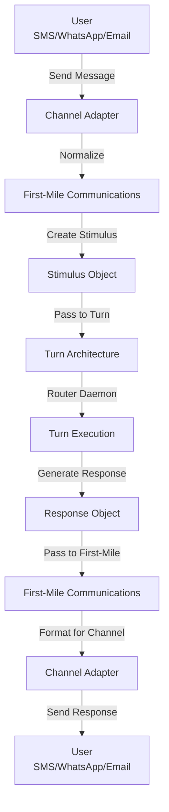

# First-Mile Communications ↔ Turn Architecture Integration

**Status:** Specification v1.0  
**Last Updated:** 2025-11-05  
**Priority:** MEDIUM (Input/Output)

## Overview

This integration defines how user input flows from communication channels (SMS, WhatsApp, email, etc.) through the First-Mile Communications layer into turn execution, and how responses flow back to users.

### Key Concepts

- **Channel**: Communication medium (SMS, WhatsApp, email, web)
- **First-Mile Communications**: Adapter layer that normalizes channel input
- **Stimulus**: Normalized user input ready for turn execution
- **Turn**: Execution unit that processes stimulus
- **Response**: Output sent back to user through channel

## Data Flow

### ASCII Diagram

```
User sends message on channel
  ↓
Channel adapter receives message
  ↓
First-Mile Communications normalizes
  ↓
Creates stimulus object
  ↓
Passes to Turn Architecture
  ↓
Turn executes
  ↓
Turn generates response
  ↓
Response passed to First-Mile Communications
  ↓
Channel adapter formats response
  ↓
Response sent to user on channel
```

### Mermaid Diagram



## API Contracts

### Channel Input → Stimulus

```json
{
  "channel": "sms",
  "raw_message": "What's the weather in Paris?",
  "sender": "+33612345678",
  "timestamp": "2025-11-05T10:30:00Z",
  "metadata": {
    "session_id": "sess_20251105_001",
    "user_id": "user_123",
    "conversation_thread_id": "thread_20251105_001"
  }
}
```

### First-Mile Normalized Stimulus

```json
{
  "stimulus_id": "stim_20251105_001",
  "type": "user_message",
  "content": "What's the weather in Paris?",
  "source": {
    "channel": "sms",
    "sender_id": "user_123",
    "session_id": "sess_20251105_001"
  },
  "metadata": {
    "conversation_thread_id": "thread_20251105_001",
    "user_preferences": {
      "language": "en",
      "timezone": "Europe/Paris"
    },
    "context": {
      "previous_messages": 5,
      "conversation_topic": "travel"
    }
  },
  "timestamp": "2025-11-05T10:30:00Z"
}
```

### Turn Response → Channel Output

```json
{
  "response_id": "resp_20251105_001",
  "stimulus_id": "stim_20251105_001",
  "content": "The weather in Paris is 15°C and cloudy.",
  "response_type": "text",
  "metadata": {
    "confidence": 0.95,
    "sources": ["weather_api"],
    "turn_id": "turn_20251105_001"
  }
}
```

### Channel-Specific Output

```json
{
  "channel": "sms",
  "recipient": "+33612345678",
  "message": "The weather in Paris is 15°C and cloudy.",
  "message_type": "text",
  "metadata": {
    "response_id": "resp_20251105_001",
    "session_id": "sess_20251105_001"
  }
}
```

## Decision Points

### 1. Channel Normalization
**When:** Message received on channel  
**What:** Normalize to standard stimulus format  
**How:** Apply channel-specific parsing rules  
**Result:** Stimulus object created

### 2. Session Management
**When:** Message received  
**What:** Determine if new session or continuation  
**How:** Check session_id and conversation thread  
**Result:** Session created or continued

### 3. Context Injection
**When:** Creating stimulus  
**What:** Include relevant context  
**How:** Query user preferences, conversation history  
**Result:** Stimulus includes context

### 4. Response Formatting
**When:** Turn completes  
**What:** Format response for channel  
**How:** Apply channel-specific formatting  
**Result:** Channel-specific output created

## Concrete Examples

### Example 1: SMS Input → Turn → SMS Output

```
User sends SMS: "What's the weather in Paris?"

First-Mile Communications:
  1. Receives SMS from +33612345678
  2. Normalizes to stimulus:
     - channel: "sms"
     - content: "What's the weather in Paris?"
     - sender_id: "user_123"
  3. Injects context:
     - user_preferences: { language: "en", timezone: "Europe/Paris" }
     - conversation_thread: "thread_20251105_001"
  4. Passes to Turn Architecture

Turn Execution:
  1. Router analyzes stimulus
  2. Determines urgency: "MEDIUM"
  3. Activates daemons: Router, Executor, Responder
  4. Executor calls weather_api
  5. Receives: "Paris 15°C, cloudy"
  6. Responder generates response: "The weather in Paris is 15°C and cloudy."

First-Mile Communications:
  1. Receives response
  2. Formats for SMS:
     - recipient: "+33612345678"
     - message: "The weather in Paris is 15°C and cloudy."
  3. Sends SMS to user

User receives SMS: "The weather in Paris is 15°C and cloudy."
```

### Example 2: WhatsApp Input with Media

```
User sends WhatsApp: "What's this wine?" + image

First-Mile Communications:
  1. Receives WhatsApp message with image
  2. Normalizes to stimulus:
     - channel: "whatsapp"
     - content: "What's this wine?"
     - attachments: [{ type: "image", url: "..." }]
  3. Injects context:
     - user_preferences: { language: "en" }
     - conversation_thread: "thread_20251105_002"
  4. Passes to Turn Architecture

Turn Execution:
  1. Router analyzes stimulus
  2. Detects image attachment
  3. Activates daemons: Router, Executor, Responder
  4. Executor calls wine_recognition_tool with image
  5. Receives: "2020 Marcel La Pierre, Burgundy"
  6. Responder generates response: "This is a 2020 Marcel La Pierre from Burgundy..."

First-Mile Communications:
  1. Receives response
  2. Formats for WhatsApp:
     - recipient: "user_123"
     - message: "This is a 2020 Marcel La Pierre from Burgundy..."
     - message_type: "text"
  3. Sends WhatsApp message to user

User receives WhatsApp: "This is a 2020 Marcel La Pierre from Burgundy..."
```

### Example 3: Email Input with Conversation Thread

```
User sends email: "Can you help me plan a trip to Paris?"

First-Mile Communications:
  1. Receives email
  2. Normalizes to stimulus:
     - channel: "email"
     - content: "Can you help me plan a trip to Paris?"
     - sender_id: "user_123@example.com"
  3. Injects context:
     - conversation_thread: "thread_paris_trip"
     - previous_messages: 3 (earlier emails about Paris)
  4. Passes to Turn Architecture

Turn Execution:
  1. Router analyzes stimulus
  2. Detects multi-turn conversation
  3. Activates daemons: Router, Context Assembler, Executor, Responder
  4. Context Assembler retrieves previous emails
  5. Executor plans trip based on context
  6. Responder generates detailed response

First-Mile Communications:
  1. Receives response
  2. Formats for email:
     - recipient: "user_123@example.com"
     - subject: "Re: Can you help me plan a trip to Paris?"
     - message: "Based on our previous discussion, here's a trip plan..."
     - in_reply_to: "original_email_id"
  3. Sends email to user

User receives email: "Based on our previous discussion, here's a trip plan..."
```

## Error Handling

### Channel Unavailable
**What:** Channel adapter fails  
**How:** Return error to user on channel  
**Recovery:** Retry on next message

### Stimulus Normalization Failure
**What:** Cannot normalize message  
**How:** Return error to user  
**Recovery:** Ask user to rephrase

### Turn Execution Failure
**What:** Turn fails to execute  
**How:** Return error response  
**Recovery:** Log error, retry on next message

### Response Formatting Failure
**What:** Cannot format response for channel  
**How:** Return generic error  
**Recovery:** Log error, investigate

## Related Integrations

- **[Conversation Threads ↔ Turn Architecture](conversation-threads-turn.md)** - Threads link messages across channels
- **[Working Memory ↔ Frontal Cortex](working-memory-frontal-cortex.md)** - Channel context injected into memory
- **[LLM Budget System ↔ Turn Architecture](llm-budget-system-turn.md)** - Budget allocated per turn

## Alignment with Si Core Tenants

- **Documentation-as-Code:** Integration fully specified; any implementation can follow the same channel normalization logic
- **Tests-First:** Test conditions drive implementation of channel adapters and stimulus creation
- **Modularity:** Channel adapters are independent; new channels can be added without modifying core
- **Technology-Agnosticism:** Uses generic stimulus format, not tied to specific channel technology

## Testing Considerations

### Test Scenario 1: SMS Input/Output
- **Setup:**
  - SMS received: "What's the weather in Paris?"
  - Channel: SMS
  - Sender: +33612345678
- **Expected:** Message normalized, turn executed, response sent
- **Acceptance Criteria:**
  - Stimulus created and normalized
  - Turn executed successfully
  - Response routed back to SMS
  - Response received by user
- **Verification Steps:**
  1. Verify stimulus created with channel: "sms"
  2. Verify stimulus.content preserved
  3. Verify turn executed
  4. Verify response generated
  5. Verify response routed to SMS
  6. Verify response received at +33612345678
- **Edge Cases:**
  - SMS with special characters
  - SMS with emoji
  - SMS with very long message

### Test Scenario 2: WhatsApp with Media
- **Setup:**
  - WhatsApp message with image attachment
  - Message: "Check this wine"
  - Image: wine_bottle.jpg
- **Expected:** Image processed, response generated
- **Acceptance Criteria:**
  - Media processed and stored
  - Turn executed with media context
  - Response generated
  - Response sent to WhatsApp
- **Verification Steps:**
  1. Verify stimulus.media array is non-empty
  2. Verify media.type equals "image"
  3. Verify media.url is accessible
  4. Verify turn executed with media
  5. Verify response generated
  6. Verify response sent to WhatsApp
- **Edge Cases:**
  - Multiple media attachments
  - Large media file
  - Unsupported media type

### Test Scenario 3: Email Thread Context
- **Setup:**
  - Email received with thread history
  - Current message: "Can you help with wine selection?"
  - Previous messages: 3 messages in thread
- **Expected:** Previous context included
- **Acceptance Criteria:**
  - Thread history captured
  - All previous messages included
  - Context accessible in turn
  - Response references previous context
- **Verification Steps:**
  1. Verify stimulus.thread_history is non-empty
  2. Verify thread_history.length equals 3
  3. Verify messages in chronological order
  4. Verify turn has access to thread
  5. Verify response references previous context
  6. Verify Turn Trace logs thread context
- **Edge Cases:**
  - Email with no thread history
  - Email with 50+ message thread
  - Thread with missing messages

### Test Scenario 4: Session Continuation
- **Setup:**
  - Message 1: "What's the weather?"
  - Message 2: "In Paris?"
  - Message 3: "For tomorrow?"
  - All in same session
- **Expected:** Session maintained across messages
- **Acceptance Criteria:**
  - All messages linked to same session
  - Session context persists
  - Conversation history available
  - Session timeout not triggered
- **Verification Steps:**
  1. Verify all 3 messages have same session_id
  2. Verify session.message_count equals 3
  3. Verify session context available in turn
  4. Verify conversation history accessible
  5. Verify session.last_message_at updates
  6. Verify Turn Trace logs session
- **Edge Cases:**
  - Session timeout between messages
  - Session with 100+ messages
  - Session with long gaps between messages

### Test Scenario 5: Channel Switching
- **Setup:**
  - Message 1: SMS from +33612345678
  - Message 2: WhatsApp from same user
  - Both should be linked
- **Expected:** Both channels work, responses on correct channels
- **Acceptance Criteria:**
  - SMS processed correctly
  - WhatsApp processed correctly
  - Responses routed to correct channels
  - User context maintained across channels
- **Verification Steps:**
  1. Verify SMS stimulus created
  2. Verify SMS response sent to SMS
  3. Verify WhatsApp stimulus created
  4. Verify WhatsApp response sent to WhatsApp
  5. Verify user context linked across channels
  6. Verify Turn Trace logs both channels
- **Edge Cases:**
  - Rapid channel switching
  - Same message on multiple channels
  - Channel switching with different users

### Test Scenario 6: Error Handling
- **Setup:**
  - Send invalid message (e.g., binary data)
  - Channel error occurs
- **Expected:** Error response
- **Acceptance Criteria:**
  - Error logged
  - User receives error message
  - System continues functioning
  - Error message is clear
- **Verification Steps:**
  1. Verify error logged with details
  2. Verify error response sent to user
  3. Verify error message is clear
  4. Verify system doesn't crash
  5. Verify Turn Trace logs error
  6. Verify system recovers
- **Edge Cases:**
  - Multiple errors in sequence
  - Error during response routing
  - Error with no recovery path

