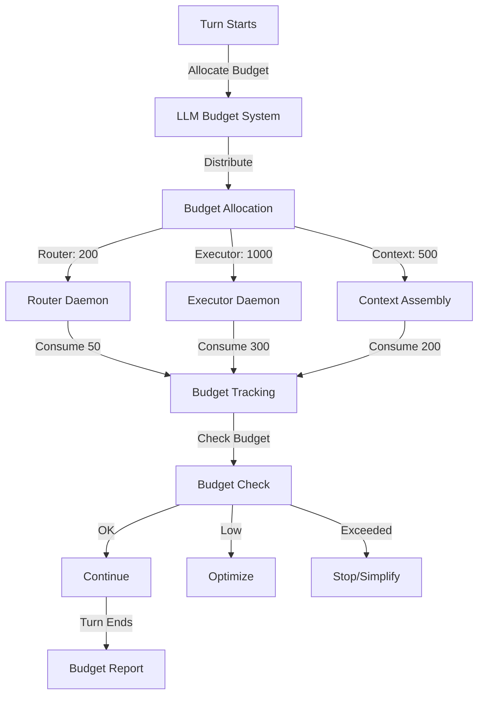

# LLM Budget System ↔ Turn Architecture Integration

**Status:** Specification v1.0  
**Last Updated:** 2025-11-05  
**Priority:** HIGH (Resource Management)

## Overview

This integration defines how the LLM Budget System tracks and enforces token budgets throughout turn execution. Every daemon, tool call, and context assembly operation consumes budget, and the system ensures Si operates within constraints.

### Key Concepts

- **Budget**: Token allocation for a turn
- **Budget Tracking**: Recording token consumption
- **Budget Enforcement**: Preventing overspend
- **Budget Allocation**: Distributing budget across daemons
- **Budget Optimization**: Maximizing value within constraints

## Data Flow

### ASCII Diagram

```
Turn starts
  ↓
LLM Budget System allocates budget
  ↓
Budget distributed to daemons
  ↓
Each daemon tracks consumption
  ↓
Context assembly consumes budget
  ↓
Tool calls consume budget
  ↓
LLM calls consume budget
  ↓
Budget checked before each operation
  ↓
If budget exceeded: operation skipped or simplified
  ↓
Turn ends
  ↓
Budget report generated
```

### Mermaid Diagram



## API Contracts

### Budget Allocation Request

```json
{
  "method": "allocate_budget",
  "params": {
    "turn_id": "turn_20251105_001",
    "total_budget": 4000,
    "allocation_strategy": "balanced",
    "constraints": {
      "min_router_budget": 100,
      "min_executor_budget": 500,
      "min_context_budget": 200
    }
  }
}
```

### Budget Allocation Response

```json
{
  "allocation_id": "alloc_20251105_001",
  "total_budget": 4000,
  "allocations": {
    "router": 400,
    "clarifier": 200,
    "context_assembler": 800,
    "executor": 1500,
    "error_handler": 300,
    "evaluator": 400,
    "reflector": 200
  },
  "timestamp": "2025-11-05T10:30:00Z"
}
```

### Budget Consumption Request

```json
{
  "method": "consume_budget",
  "params": {
    "daemon": "executor",
    "operation": "tool_call",
    "tokens_consumed": 150,
    "operation_id": "op_20251105_001"
  }
}
```

### Budget Check Request

```json
{
  "method": "check_budget",
  "params": {
    "daemon": "executor",
    "operation": "context_assembly",
    "estimated_tokens": 300
  }
}
```

### Budget Check Response

```json
{
  "status": "ok",
  "remaining_budget": 1200,
  "can_proceed": true,
  "recommendation": "proceed_normally"
}
```

## Decision Points

### 1. Budget Allocation
**When:** Turn starts  
**What:** Allocate budget to daemons  
**How:** Use allocation strategy  
**Result:** Budget allocated

### 2. Budget Consumption
**When:** Operation completes  
**What:** Record token consumption  
**How:** Track actual tokens used  
**Result:** Budget updated

### 3. Budget Check
**When:** Before operation  
**What:** Verify sufficient budget  
**How:** Compare estimated vs. remaining  
**Result:** Proceed | Optimize | Stop

### 4. Budget Optimization
**When:** Budget running low  
**What:** Reduce token consumption  
**How:** Simplify operations, reduce context  
**Result:** Operations continue within budget

## Concrete Examples

### Example 1: Standard Budget Allocation

```
Turn 1: User asks "What's the weather?"

LLM Budget System:
  1. Allocates total budget: 4000 tokens
  2. Distributes:
     - Router: 400 tokens
     - Working Memory: 800 tokens
     - Executor: 1500 tokens
     - Error Handler: 300 tokens
     - Evaluator: 400 tokens

Router Daemon:
  1. Analyzes input: "What's the weather?"
  2. Consumes: 50 tokens
  3. Remaining: 350 tokens

Working Memory:
  1. Assembles context
  2. Consumes: 200 tokens
  3. Remaining: 600 tokens

Executor Daemon:
  1. Calls weather_api
  2. Consumes: 300 tokens
  3. Remaining: 1200 tokens

Turn Ends:
  1. Total consumed: 550 tokens
  2. Total remaining: 3450 tokens
  3. Budget report: "Efficient execution"
```

### Example 2: Budget Optimization

```
Turn 2: User asks "Plan a 2-week trip to Europe"

LLM Budget System:
  1. Allocates total budget: 4000 tokens
  2. Distributes:
     - Router: 400 tokens
     - Working Memory: 800 tokens
     - Executor: 1500 tokens
     - Evaluator: 300 tokens

Router Daemon:
  1. Analyzes input: "Plan a 2-week trip to Europe"
  2. Consumes: 100 tokens
  3. Remaining: 300 tokens

Working Memory:
  1. Starts assembling context
  2. Checks budget: "Estimated 600 tokens needed"
  3. Budget check: "Only 300 remaining"
  4. Optimizes: "Reduce context to essential items"
  5. Consumes: 250 tokens
  6. Remaining: 50 tokens

Executor Daemon:
  1. Checks budget: "Estimated 500 tokens needed"
  2. Budget check: "Only 50 remaining"
  3. Optimizes: "Use simplified planning"
  4. Consumes: 40 tokens
  5. Remaining: 10 tokens

Turn Ends:
  1. Total consumed: 490 tokens
  2. Total remaining: 3510 tokens
  3. Budget report: "Optimized execution due to budget constraints"
```

### Example 3: Budget Exceeded

```
Turn 3: User asks "Analyze 100 research papers"

LLM Budget System:
  1. Allocates total budget: 4000 tokens
  2. Distributes:
     - Router: 400 tokens
     - Working Memory: 800 tokens
     - Executor: 1500 tokens
     - Evaluator: 300 tokens

Router Daemon:
  1. Analyzes input: "Analyze 100 research papers"
  2. Consumes: 150 tokens
  3. Remaining: 250 tokens

Working Memory:
  1. Checks budget: "Estimated 600 tokens needed"
  2. Budget check: "Only 250 remaining"
  3. Optimizes: "Reduce to 50 papers"
  4. Consumes: 200 tokens
  5. Remaining: 50 tokens

Executor Daemon:
  1. Checks budget: "Estimated 500 tokens needed"
  2. Budget check: "Only 50 remaining"
  3. Decision: "Cannot proceed with full analysis"
  4. Responds: "I can analyze 50 papers within budget"
  5. Consumes: 40 tokens

Turn Ends:
  1. Total consumed: 540 tokens
  2. Total remaining: 3460 tokens
  3. Budget report: "Scope reduced due to budget constraints"
```

## Error Handling

### Budget Exceeded
**What:** Operation would exceed budget  
**How:** Simplify operation or skip  
**Recovery:** Inform user of constraints

### Budget Allocation Failure
**What:** Cannot allocate budget  
**How:** Use default allocation  
**Recovery:** Log error, continue

### Budget Tracking Failure
**What:** Cannot track consumption  
**How:** Log error, continue  
**Recovery:** Retry on next turn

### Invalid Budget Request
**What:** Budget request malformed  
**How:** Reject request, log error  
**Recovery:** Retry with valid request

## Related Integrations

- **[Working Memory ↔ Frontal Cortex](working-memory-frontal-cortex.md)** - Budget constraints on context assembly
- **[Turn Trace ↔ System Change Proposals](turn-trace-system-change-proposals.md)** - Budget consumption tracked in turn trace
- **[First-Mile Communications ↔ Turn Architecture](first-mile-communications-turn.md)** - Budget allocated per turn

## Alignment with Si Core Tenants

- **Documentation-as-Code:** Integration fully specified; any implementation can follow the same budget allocation logic
- **Tests-First:** Test conditions drive implementation of budget tracking and enforcement
- **Modularity:** Budget system is separate; budget changes don't require turn code changes
- **Technology-Agnosticism:** Uses generic token budget format, not tied to specific LLM

## Testing Considerations

### Test Scenario 1: Budget Allocation
- **Setup:**
  - Turn starts
  - Budget policy: 2000 tokens per turn
  - Turn ID: turn_123
- **Expected:** Budget allocated to daemons
- **Acceptance Criteria:**
  - Budget allocated with unique budget_id
  - Budget_total equals 2000
  - Budget_remaining equals 2000
  - Allocations sum to total budget
- **Verification Steps:**
  1. Verify budget_id is unique
  2. Verify budget_total equals 2000
  3. Verify budget_remaining equals 2000
  4. Verify daemon allocations sum to 2000
  5. Verify each daemon has allocation
  6. Verify Turn Trace logs allocation
- **Edge Cases:**
  - Budget of 0 tokens
  - Budget of 1 token
  - Budget of 1000000 tokens

### Test Scenario 2: Budget Consumption
- **Setup:**
  - Turn starts with budget: 2000 tokens
  - Tool 1 consumes: 500 tokens
  - Tool 2 consumes: 300 tokens
  - Context assembly consumes: 200 tokens
- **Expected:** Consumption recorded
- **Acceptance Criteria:**
  - Budget_consumed equals 1000
  - Budget_remaining equals 1000
  - All consumption logged
- **Verification Steps:**
  1. Verify budget_consumed equals 1000
  2. Verify budget_remaining equals 1000
  3. Verify consumption log has 3 entries
  4. Verify each entry has: tool_name, tokens_consumed, timestamp
  5. Verify Turn Trace logs all consumption
  6. Verify budget_remaining = budget_total - budget_consumed
- **Edge Cases:**
  - Single large consumption
  - Many small consumptions
  - Consumption with 0 tokens

### Test Scenario 3: Budget Check
- **Setup:**
  - Turn starts with budget: 1000 tokens
  - Budget consumed: 600 tokens
  - Check budget before operation requiring 300 tokens
- **Expected:** Check returns accurate status
- **Acceptance Criteria:**
  - Check returns: can_proceed = true
  - Check returns: budget_remaining = 400
  - Decision is correct
- **Verification Steps:**
  1. Verify check returns can_proceed = true
  2. Verify check returns budget_remaining = 400
  3. Verify operation proceeds
  4. Verify Turn Trace logs check
  5. Verify check doesn't consume budget
  6. Verify check is fast (< 10ms)
- **Edge Cases:**
  - Budget exactly sufficient
  - Budget insufficient
  - Budget check with 0 remaining

### Test Scenario 4: Budget Optimization
- **Setup:**
  - Turn starts with budget: 500 tokens (limited)
  - WM needs 800 tokens for full context
  - Budget system optimizes
- **Expected:** Operations simplified
- **Acceptance Criteria:**
  - Context size <= 500 tokens
  - Budget_remaining >= 0
  - Essential information included
  - Non-essential excluded
- **Verification Steps:**
  1. Verify context size <= 500 tokens
  2. Verify budget_remaining >= 0
  3. Verify essential mandates present
  4. Verify non-essential items excluded
  5. Verify Turn Trace logs optimization
  6. Verify context quality acceptable
- **Edge Cases:**
  - Budget exactly consumed
  - Budget exceeded (error case)
  - Budget with no room for mandates

### Test Scenario 5: Budget Exceeded
- **Setup:**
  - Turn starts with budget: 1000 tokens
  - Tool 1 consumes: 600 tokens
  - Tool 2 tries to consume: 500 tokens (would exceed)
- **Expected:** Operation skipped or simplified
- **Acceptance Criteria:**
  - Tool 2 blocked or simplified
  - Budget_remaining equals 400
  - Error logged
- **Verification Steps:**
  1. Verify Tool 1 executes (600 tokens consumed)
  2. Verify budget_remaining equals 400
  3. Verify Tool 2 blocked or simplified
  4. Verify error returned or operation simplified
  5. Verify Turn Trace logs decision
  6. Verify system doesn't crash
- **Edge Cases:**
  - Exactly at budget limit
  - Multiple tools trying to exceed
  - Exceed during context assembly

### Test Scenario 6: Multiple Daemons
- **Setup:**
  - Turn starts with budget: 2000 tokens
  - Router consumes: 100 tokens
  - Working Memory consumes: 400 tokens
  - Executor consumes: 600 tokens
  - Evaluator consumes: 200 tokens
- **Expected:** All consumption tracked
- **Acceptance Criteria:**
  - Total consumption equals 1300
  - Budget_remaining equals 700
  - All daemons tracked
- **Verification Steps:**
  1. Verify total consumption equals 1300
  2. Verify budget_remaining equals 700
  3. Verify Router consumption logged
  4. Verify Working Memory consumption logged
  5. Verify Executor consumption logged
  6. Verify Evaluator consumption logged
- **Edge Cases:**
  - Daemon with 0 consumption
  - Daemon with very large consumption
  - Concurrent daemon consumption

### Test Scenario 7: Budget Report
- **Setup:**
  - Turn completes
  - Budget allocated: 2000 tokens
  - Budget consumed: 1200 tokens
  - Budget remaining: 800 tokens
- **Expected:** Budget report generated
- **Acceptance Criteria:**
  - Report includes all consumption
  - Report accurate
  - Report includes breakdown by daemon
- **Verification Steps:**
  1. Verify report.budget_total equals 2000
  2. Verify report.budget_consumed equals 1200
  3. Verify report.budget_remaining equals 800
  4. Verify report.consumption_breakdown is non-empty
  5. Verify report.efficiency_ratio calculated
  6. Verify Turn Trace logs report
- **Edge Cases:**
  - No daemons executed
  - All budget consumed
  - No budget consumed

