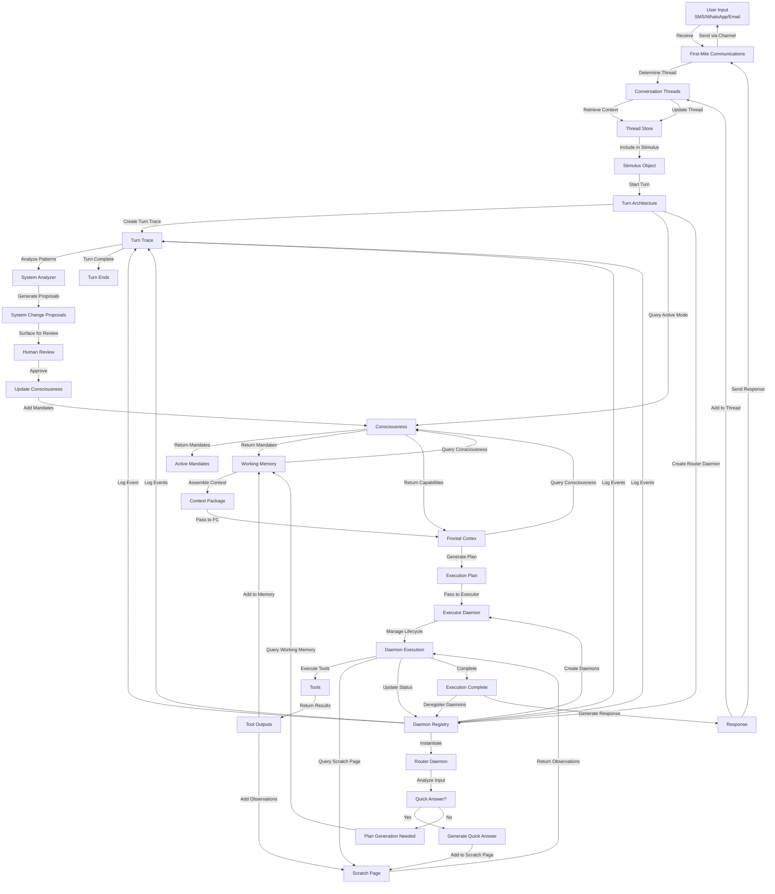

# Master Integration Flow Diagram

**Status:** v1.0 (Stable)
**Last Updated:** 2025-11-07
**Purpose:** Comprehensive visualization of how all Si systems work together end-to-end

## Overview

This document provides a master integration flow diagram showing how all major Si systems interact during a complete turn cycle. It serves as a reference for understanding the system architecture and how data flows between components.

## Complete Turn Cycle Flow

## System Component Interactions

### 1. Input Processing Phase
- **First-Mile Communications** receives user input from channels
- **Conversation Threads** determines thread continuity
- **Stimulus** created with thread context
- **Turn Trace** begins recording

### 2. Consciousness Activation Phase
- **Consciousness** loads active mode
- **Active Mandates** determined
- **Capabilities** identified
- **Constraints** applied

### 3. Routing Phase
- **Router Daemon** created by Executor
- **Quick Answer** evaluated
- **Scratch Page** receives routing decision
- **Turn Trace** logs routing decision

### 4. Context Assembly Phase
- **Working Memory** queries Consciousness for mandates
- **Memory Types** (Working, Episodic, Semantic, Conversation History) queried
- **Context Package** assembled
- **Budget** tracked

### 5. Planning Phase
- **Frontal Cortex** receives context
- **Consciousness** queried for capabilities
- **Execution Plan** generated
- **Daemon Types** specified

### 6. Execution Phase
- **Executor Daemon** created
- **Daemon Registry** tracks instances
- **Daemons** created per plan
- **Tools** executed
- **Scratch Page** used for daemon communication
- **Turn Trace** logs all events
- **Resource Budget** tracked

### 7. Memory Update Phase
- **Tool Outputs** ingested into memory
- **Episodic Memory** updated
- **Semantic Memory** updated
- **Conversation History** updated
- **Working Memory** refreshed

### 8. Response Generation Phase
- **Response** generated from execution results
- **Conversation Threads** updated
- **Thread Store** persisted
- **Turn Trace** finalized

### 9. Analysis & Improvement Phase
- **System Analyzer** processes Turn Trace
- **Patterns** detected
- **System Change Proposals** generated
- **Human Review** conducted
- **Consciousness** updated with approved changes

### 10. Output Phase
- **Response** sent via channel
- **First-Mile Communications** routes response
- **User** receives response

## Key Integration Points

### High-Priority Integrations (Core Loop)
1. **Consciousness ↔ Frontal Cortex** - Mandates guide planning
2. **Scratch Page ↔ Frontal Cortex** - Observations inform planning
3. **Working Memory ↔ Consciousness** - Context assembly uses mandates
4. **Turn Trace ↔ System Change Proposals** - Traces feed improvement proposals

### Extended Integrations (Execution)
5. **Working Memory ↔ Frontal Cortex** - Context assembly and outcome recording
6. **Tools ↔ Scratch Page** - Tool observations shared
7. **Daemons ↔ Scratch Page** - Daemon observations shared
8. **First-Mile Communications ↔ Turn Architecture** - Input/output routing
9. **Tools ↔ Working Memory** - Tool outputs ingested
10. **LLM Budget System ↔ Turn Architecture** - Budget tracking
11. **Conversation Threads ↔ Turn Architecture** - Thread continuity

### New Integrations (Daemon Orchestration & Evolution)
12. **Executor ↔ Daemon Registry** - Daemon discovery and lifecycle
13. **Consciousness ↔ Consciousness Modes** - Mode loading and switching
14. **Daemon Registry ↔ Turn Trace** - Daemon event logging
15. **System Change Proposals ↔ Consciousness** - Consciousness evolution

## Data Flow Patterns

### Pattern 1: Query-Response
- Working Memory queries Consciousness
- Daemons query Scratch Page
- Frontal Cortex queries Working Memory
- Executor queries Daemon Registry

### Pattern 2: Event-Driven
- Tools emit observations to Scratch Page
- Daemons emit observations to Scratch Page
- Turn Trace emits flags to System Change Proposals
- Daemon Registry emits events to Turn Trace

### Pattern 3: Batch Processing
- System Analyzer processes multiple turn traces
- Summarizer processes episodic memory
- Skill Extractor processes outcomes

### Pattern 4: Streaming
- Turn Trace receives events during execution
- Working Memory receives budget updates
- Observability receives telemetry

## System Boundaries

### Turn-Scoped Systems
- Daemons (created per turn, isolated to turn)
- Scratch Page (per-turn observations)
- Turn Trace (per-turn events)
- Execution Plan (per-turn)

### Cross-Turn Systems
- Consciousness (persistent, evolves over time)
- Working Memory (persistent, updated each turn)
- Conversation Threads (persistent, spans turns)
- Daemon Registry (persistent, tracks types and instances)
- System Change Proposals (persistent, accumulates over time)

### Channel-Specific Systems
- First-Mile Communications (per-channel)
- Conversation Threads (cross-channel)

## Performance Characteristics

### Latency Budget
- Input processing: < 100ms
- Consciousness query: < 50ms
- Router decision: < 5s
- Context assembly: < 2s
- Planning: < 10s
- Execution: < 30s
- Response generation: < 1s
- Total turn: < 50s

### Resource Budget
- Tokens per turn: 2000-5000
- Memory per turn: 100-500MB
- Daemons per turn: 3-10
- Tools per turn: 1-5

## Failure Modes & Recovery

### Input Processing Failure
- **Recovery:** Return error to user, log to Turn Trace
- **Impact:** Turn fails, user notified

### Consciousness Query Failure
- **Recovery:** Use default mandates, continue
- **Impact:** Degraded decision-making

### Context Assembly Failure
- **Recovery:** Return partial context, continue
- **Impact:** Reduced context quality

### Planning Failure
- **Recovery:** Use fallback plan, continue
- **Impact:** Limited execution options

### Execution Failure
- **Recovery:** Error Handler daemon manages recovery
- **Impact:** Partial execution, may retry

### Memory Update Failure
- **Recovery:** Log error, retry on next turn
- **Impact:** Memory inconsistency

### Response Generation Failure
- **Recovery:** Return error response, log to Turn Trace
- **Impact:** User receives error

## Alignment with Si Core Tenants

- **Documentation-as-Code:** Complete system flow specified as documentation
- **Tests-First:** Each integration has comprehensive test conditions
- **Modularity:** Systems are independent with clear boundaries
- **Technology-Agnosticism:** Uses generic JSON contracts throughout

## Related Documents

- **[Integration Guide README](README.md)** - Overview of all integrations
- **[Consciousness ↔ Frontal Cortex](consciousness-frontal-cortex.md)** - Core planning integration
- **[Working Memory ↔ Consciousness](working-memory-consciousness.md)** - Context assembly
- **[Executor ↔ Daemon Registry](executor-daemon-registry.md)** - Daemon orchestration
- **[Turn Trace ↔ System Change Proposals](turn-trace-system-change-proposals.md)** - System improvement

