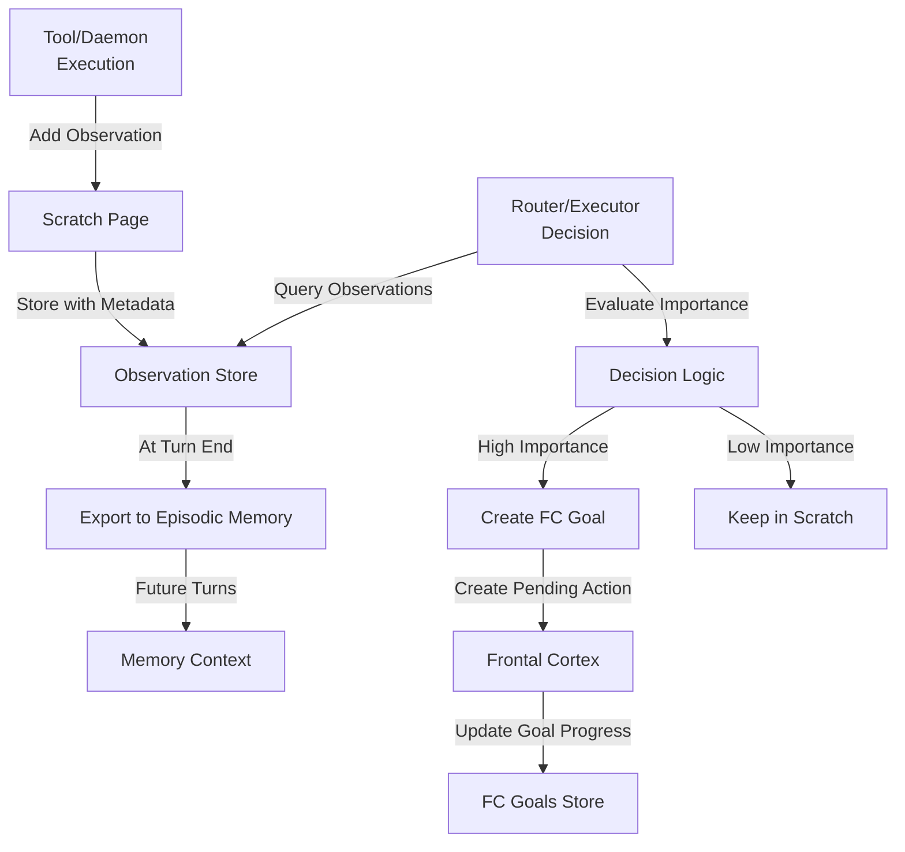

# Scratch Page ↔ Frontal Cortex Integration

**Status:** Specification v1.0  
**Last Updated:** 2025-11-05  
**Priority:** HIGH (Observations → Actions)

## Overview

This integration defines how observations captured in the Scratch Page inform Frontal Cortex goal creation and action planning. Observations are low-commitment insights; when they warrant action, they become high-commitment Frontal Cortex goals and pending actions.

### Key Concepts

- **Scratch Page**: Transient observations, insights, and alerts from tools and daemons
- **Frontal Cortex**: Durable goals and actionable next steps
- **Observation**: A single insight or alert (e.g., "user prefers wine X")
- **Goal**: A long-horizon objective created from observations
- **Pending Action**: A concrete next step assigned to agent or user

## Data Flow

### ASCII Diagram

```
Tool/Daemon executes
  ↓
Adds observation to Scratch Page
  ↓
Observation stored with metadata
  ↓
Router/Executor reviews Scratch Page
  ↓
Evaluates: "Does this warrant a goal?"
  ↓
If yes: Create FC goal + pending action
If no: Observation remains in Scratch
  ↓
At turn end: Export observations to episodic memory
```

### Mermaid Diagram



## API Contracts

### Request: Add Observation to Scratch Page

```json
{
  "type": "contextual_insight",
  "content": "User prefers Burgundy wines, especially 2020 Marcel La Pierre",
  "confidence": 0.95,
  "tags": ["wine", "preference", "user_profile"],
  "source": {
    "tool": "wine_search",
    "turn_id": "turn_20251105_001",
    "timestamp": "2025-11-05T10:30:00Z"
  },
  "context": {
    "goal_id": "find_wine_recommendation",
    "user_id": "user_123"
  },
  "ttl_minutes": 1440
}
```

### Request: Query Observations

```json
{
  "query": "List observations about wine preferences",
  "metadata": {
    "tags": ["wine", "preference"],
    "status": "active",
    "min_confidence": 0.8,
    "limit": 10
  }
}
```

### Response: Observations List

```json
{
  "observations": [
    {
      "observation_id": "obs_20251105_001",
      "type": "contextual_insight",
      "content": "User prefers Burgundy wines",
      "confidence": 0.95,
      "tags": ["wine", "preference"],
      "created_at": "2025-11-05T10:30:00Z",
      "expires_at": "2025-11-06T10:30:00Z",
      "context": {
        "goal_id": "find_wine_recommendation"
      }
    }
  ],
  "total_count": 1,
  "query_time_ms": 45
}
```

### Request: Create FC Goal from Observation

```json
{
  "goal_type": "find_wine_recommendation",
  "title": "Find wine recommendation for user",
  "description": "Based on observation that user prefers Burgundy wines",
  "priority": "high",
  "evidence": {
    "observation_id": "obs_20251105_001",
    "confidence": 0.95
  },
  "pending_actions": [
    {
      "action_type": "research_wines",
      "description": "Research Burgundy wines matching user preferences",
      "assigned_to": "agent",
      "priority": "high"
    }
  ]
}
```

## Decision Points

### 1. Observation Evaluation
**When:** Observation added to Scratch Page  
**What:** Determine if observation warrants FC goal  
**How:** Evaluate importance, confidence, and relevance  
**Result:** Create goal | Keep in Scratch | Archive

### 2. Goal Creation
**When:** Observation warrants action  
**What:** Create FC goal with pending actions  
**How:** Link observation as evidence  
**Result:** Goal created, pending actions assigned

### 3. Progress Tracking
**When:** Turn ends  
**What:** Update goal progress based on observations  
**How:** Query Scratch Page for goal-related observations  
**Result:** Goal progress updated

### 4. Observation Expiration
**When:** Observation TTL expires  
**What:** Archive or delete observation  
**How:** Check TTL at turn end  
**Result:** Observation archived or deleted

## Concrete Examples

### Example 1: Observation → Goal (Happy Path)

```
Turn 1:
  1. User asks: "What wine should I get for dinner?"
  2. Tool searches wines, finds: "2020 Marcel La Pierre - Burgundy"
  3. Tool adds observation: "User interested in Burgundy wines"
  4. Observation stored in Scratch Page

Turn 2:
  1. Router reviews Scratch Page
  2. Finds observation: "User interested in Burgundy wines"
  3. Evaluates: "This is high-confidence, user-relevant"
  4. Creates FC goal: "Build wine recommendation profile"
  5. Creates pending action: "Research more Burgundy wines"
  6. Logs to Turn Trace: "Observation promoted to goal"

Turn 3+:
  1. Future turns see FC goal
  2. Can make better wine recommendations
  3. Observation has become durable knowledge
```

### Example 2: Observation Remains in Scratch

```
Turn 1:
  1. Tool detects: "API response time was 2.3 seconds"
  2. Adds observation: "API performance metric"
  3. Observation stored in Scratch Page

Turn 2:
  1. Router reviews Scratch Page
  2. Finds observation: "API response time was 2.3 seconds"
  3. Evaluates: "This is low-importance, operational metric"
  4. Decision: "Keep in Scratch, don't create goal"
  5. Observation expires after 24 hours
  6. Logs to Turn Trace: "Observation kept in Scratch"
```

### Example 3: Multiple Observations → Single Goal

```
Turn 1:
  1. Tool adds: "User mentioned budget constraint: $50"
  2. Observation stored in Scratch Page

Turn 2:
  1. Tool adds: "User mentioned time constraint: 1 hour"
  2. Observation stored in Scratch Page

Turn 3:
  1. Router reviews Scratch Page
  2. Finds two related observations
  3. Evaluates: "These form a coherent goal"
  4. Creates FC goal: "Find wine within budget and time constraints"
  5. Creates pending action: "Search wines under $50"
  6. Logs to Turn Trace: "Multiple observations combined into goal"
```

## Error Handling

### Observation Storage Failure
**What:** Scratch Page storage fails  
**How:** Return error to tool/daemon  
**Recovery:** Retry on next turn, log error

### Goal Creation Failure
**What:** FC goal creation fails  
**How:** Keep observation in Scratch, retry later  
**Recovery:** Retry on next turn, investigate FC issue

### Observation Query Timeout
**What:** Query Scratch Page times out  
**How:** Return partial results or empty list  
**Recovery:** Retry with simpler query

### Conflicting Observations
**What:** Multiple observations contradict each other  
**How:** Return all observations, let FC decide  
**Recovery:** Log conflict, may require user clarification

## Related Integrations

- **[Consciousness ↔ Frontal Cortex](consciousness-frontal-cortex.md)** - FC validates goals against consciousness mandates before execution
- **[Tools ↔ Scratch Page](tools-scratch-page.md)** - Tools add observations that FC evaluates for goal creation
- **[Daemons ↔ Scratch Page](daemons-scratch-page.md)** - Daemons add observations that inform FC planning
- **[Working Memory ↔ Frontal Cortex](working-memory-frontal-cortex.md)** - Observations inform context assembly for planning

## Alignment with Si Core Tenants

- **Documentation-as-Code:** Integration fully specified as documentation; any implementation can follow the same observation-to-goal logic
- **Tests-First:** Test conditions drive implementation of observation evaluation and goal creation logic
- **Modularity:** Scratch Page and FC are separate; observations are independent of FC implementation
- **Technology-Agnosticism:** Uses generic JSON observation format, not tied to specific technology

## Testing Considerations

### Test Scenario 1: High-Confidence Observation → Goal Creation
- **Setup:**
  - Add observation: `{type: "contextual_insight", content: "User prefers Burgundy wines", confidence: 0.95, tags: ["wine", "preference"]}`
  - Configure FC goal creation threshold: confidence >= 0.9
- **Expected:** FC creates goal from observation
- **Acceptance Criteria:**
  - Goal created with observation_id reference
  - Goal status is "pending"
  - Goal appears in FC goals store
  - Observation remains in Scratch Page
- **Verification Steps:**
  1. Verify goal created in FC goals store
  2. Verify goal.observation_id matches observation_id
  3. Verify goal.status equals "pending"
  4. Verify goal.created_at timestamp is recent
  5. Verify Scratch Page still contains observation
  6. Verify Turn Trace logs goal creation
- **Edge Cases:**
  - Confidence exactly at threshold (0.9)
  - Multiple observations with same tag
  - Observation with no tags

### Test Scenario 2: Low-Confidence Observation (No Goal)
- **Setup:**
  - Add observation: `{type: "contextual_insight", content: "User might like red wine", confidence: 0.6, tags: ["wine"]}`
  - Configure FC goal creation threshold: confidence >= 0.9
- **Expected:** Observation remains in Scratch Page, no goal created
- **Acceptance Criteria:**
  - No goal created
  - Observation remains in Scratch Page
  - Observation not marked as processed
- **Verification Steps:**
  1. Verify no goal created in FC goals store
  2. Verify observation still queryable in Scratch Page
  3. Verify observation.status remains "active"
  4. Verify Turn Trace logs: "Observation below threshold"
  5. Verify system doesn't crash on low-confidence observation
  6. Verify observation can be queried later
- **Edge Cases:**
  - Confidence just below threshold (0.89)
  - Multiple low-confidence observations
  - Observation with zero confidence

### Test Scenario 3: Multiple Observations → Single Goal
- **Setup:**
  - Add observation 1: `{content: "User prefers Burgundy wines", confidence: 0.95, tags: ["wine", "preference"]}`
  - Add observation 2: `{content: "User mentioned budget of $50", confidence: 0.9, tags: ["budget", "constraint"]}`
  - Both related to goal: "find_wine_recommendation"
- **Expected:** FC creates single goal from multiple observations
- **Acceptance Criteria:**
  - Single goal created
  - Goal includes both observation IDs
  - Goal status is "pending"
  - Both observations linked to goal
- **Verification Steps:**
  1. Verify single goal created (not two)
  2. Verify goal.observation_ids contains both IDs
  3. Verify goal.context includes both observations
  4. Verify goal.status equals "pending"
  5. Verify Turn Trace logs: "Goal created from 2 observations"
  6. Verify both observations marked as "linked_to_goal"
- **Edge Cases:**
  - Three or more related observations
  - Observations with conflicting information
  - Observations added at different times

### Test Scenario 4: Observation Expiration
- **Setup:**
  - Add observation: `{content: "...", ttl_minutes: 1}`
  - Wait 61 seconds
- **Expected:** Observation expires and is removed
- **Acceptance Criteria:**
  - Observation removed from Scratch Page after TTL
  - Query returns empty result
  - Expiration logged
- **Verification Steps:**
  1. Verify observation queryable before TTL
  2. Wait for TTL to expire
  3. Verify observation not queryable after TTL
  4. Verify Turn Trace logs expiration
  5. Verify no goal created from expired observation
  6. Verify system doesn't crash on expiration
- **Edge Cases:**
  - Observation expires during goal creation
  - Multiple observations with different TTLs
  - TTL of 0 (immediate expiration)

### Test Scenario 5: Goal Progress Update from Observations
- **Setup:**
  - Create goal: `{goal_id: "find_wine", status: "pending"}`
  - Add observation 1: `{content: "Found 3 Burgundy options", confidence: 0.95}`
  - Add observation 2: `{content: "User confirmed preference", confidence: 0.9}`
- **Expected:** Goal progress updated based on observations
- **Acceptance Criteria:**
  - Goal progress increases as observations added
  - Goal status may change based on observations
  - Observations linked to goal
- **Verification Steps:**
  1. Verify goal.progress increases with each observation
  2. Verify goal.linked_observations contains both observation IDs
  3. Verify goal.status may change (e.g., pending → in_progress)
  4. Verify Turn Trace logs progress updates
  5. Verify goal can be queried with updated progress
  6. Verify observations remain in Scratch Page
- **Edge Cases:**
  - Conflicting observations affecting progress
  - Progress exceeding 100%
  - Multiple observations added simultaneously

### Test Scenario 6: Observation Query by Tag
- **Setup:**
  - Add observation 1: `{content: "...", tags: ["wine", "preference"]}`
  - Add observation 2: `{content: "...", tags: ["wine", "budget"]}`
  - Add observation 3: `{content: "...", tags: ["travel", "destination"]}`
  - Query: `{tags: ["wine"], status: "active"}`
- **Expected:** Only observations with "wine" tag returned
- **Acceptance Criteria:**
  - Query returns 2 observations (1 and 2)
  - Query does not return observation 3
  - Results include all required fields
- **Verification Steps:**
  1. Verify query returns exactly 2 results
  2. Verify both results have "wine" tag
  3. Verify observation 3 not in results
  4. Verify results include: observation_id, content, confidence, tags
  5. Verify query time < 50ms
  6. Verify pagination works for large result sets
- **Edge Cases:**
  - Query with multiple tags (AND logic)
  - Query with no matching observations
  - Query with empty tag list

