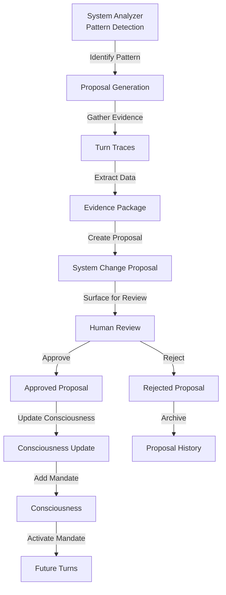

# System Change Proposals ↔ Consciousness Integration

**Status:** v1.0 (Stable)
**Last Updated:** 2025-11-07
**Priority:** MEDIUM (System Evolution)

## Overview

This integration defines how System Change Proposals inform updates to Consciousness. When the System Analyzer identifies patterns suggesting new mandates, capabilities, or governance rules are needed, it generates proposals that humans review and implement as consciousness updates.

### Key Concepts

- **System Change Proposals**: Documented improvement suggestions with evidence
- **Consciousness**: Si's values, mandates, identity, capabilities, and governance rules
- **Proposal Review**: Human evaluation of proposed consciousness changes
- **Consciousness Update**: Implementation of approved proposals
- **Evidence**: Data supporting the proposal (turn traces, patterns, outcomes)
- **Mandate Evolution**: How consciousness mandates change over time

## Data Flow

### ASCII Diagram

```
System Analyzer identifies pattern
  ↓
Analyzer generates proposal
  ↓
Proposal includes evidence
  ↓
Proposal surfaced for human review
  ↓
Human reviews proposal
  ↓
Human approves or rejects
  ↓
If approved: Update Consciousness
  ↓
Consciousness updated with new mandate
  ↓
New mandate active in future turns
```

### Mermaid Diagram



## API Contracts

### Propose Consciousness Update

**Request from System Analyzer:**
```json
{
  "method": "propose_consciousness_update",
  "params": {
    "proposal_id": "prop_20251106_001",
    "proposal_type": "new_mandate",
    "title": "Add mandate for user data privacy",
    "description": "Pattern detected: Users frequently ask about data privacy. Recommend adding mandate to prioritize privacy in all operations.",
    "evidence": {
      "turn_count": 47,
      "pattern_frequency": 0.23,
      "confidence": 0.92,
      "sample_turns": ["turn_20251105_001", "turn_20251105_015", "turn_20251105_032"],
      "key_phrases": ["privacy", "data protection", "confidentiality"]
    },
    "proposed_change": {
      "type": "mandate",
      "mandate": {
        "id": "user_data_privacy",
        "type": "safety",
        "text": "Prioritize user data privacy in all operations. Never share user data without explicit consent.",
        "priority": "critical"
      }
    }
  }
}
```

**Response:**
```json
{
  "status": "ok",
  "proposal_id": "prop_20251106_001",
  "status": "pending_review",
  "created_at": "2025-11-06T10:30:00Z"
}
```

### Review Consciousness Update Proposal

**Request from Human:**
```json
{
  "method": "review_proposal",
  "params": {
    "proposal_id": "prop_20251106_001",
    "decision": "approved",
    "reviewer_notes": "This is a critical mandate. Approved for immediate implementation.",
    "implementation_notes": "Add to safety mandates section. Notify all daemons of new mandate."
  }
}
```

**Response:**
```json
{
  "status": "ok",
  "proposal_id": "prop_20251106_001",
  "decision": "approved",
  "reviewed_at": "2025-11-06T11:00:00Z"
}
```

### Apply Consciousness Update

**Request to Consciousness:**
```json
{
  "method": "apply_update",
  "params": {
    "proposal_id": "prop_20251106_001",
    "update_type": "add_mandate",
    "mandate": {
      "id": "user_data_privacy",
      "type": "safety",
      "text": "Prioritize user data privacy in all operations. Never share user data without explicit consent.",
      "priority": "critical",
      "added_by": "system_analyzer",
      "added_at": "2025-11-06T11:05:00Z"
    }
  }
}
```

**Response:**
```json
{
  "status": "ok",
  "update_applied": true,
  "mandate_id": "user_data_privacy",
  "active_at": "2025-11-06T11:05:00Z"
}
```

## Decision Points

### 1. Pattern Detection
**When:** System Analyzer processes turn traces  
**What:** Identify patterns suggesting consciousness changes  
**How:** Analyze turn data for recurring themes  
**Result:** Pattern identified with confidence score

### 2. Proposal Generation
**When:** Pattern detected with high confidence  
**What:** Generate proposal with evidence  
**How:** Package pattern data as proposal  
**Result:** Proposal created and surfaced

### 3. Human Review
**When:** Proposal surfaced  
**What:** Human evaluates proposal  
**How:** Review evidence, consider implications  
**Result:** Approved or rejected

### 4. Consciousness Update
**When:** Proposal approved  
**What:** Update consciousness with new mandate  
**How:** Call Consciousness.apply_update  
**Result:** New mandate active in future turns

## Concrete Examples

### Example 1: New Safety Mandate

```
Turn 1-50: System operates normally

System Analyzer (after turn 50):
  1. Analyzes turn traces
  2. Detects pattern: "Users frequently ask about data privacy"
  3. Confidence: 92%
  4. Generates proposal:
     - Type: new_mandate
     - Title: "Add mandate for user data privacy"
     - Evidence: 23 turns mention privacy (47% of turns)
     - Proposed mandate: "Prioritize user data privacy"

Human Review:
  1. Reviews proposal
  2. Sees evidence: 23 turns, 92% confidence
  3. Approves: "Critical mandate, implement immediately"

Consciousness Update:
  1. Receives approval
  2. Adds mandate to safety mandates
  3. Activates mandate
  4. Notifies all daemons

Turn 51+:
  1. All daemons operate with new privacy mandate
  2. Privacy prioritized in all decisions
  3. User data protected by default
```

### Example 2: New Capability

```
Turn 1-100: System operates normally

System Analyzer (after turn 100):
  1. Analyzes turn traces
  2. Detects pattern: "Users frequently ask for weather forecasts"
  3. Detects pattern: "System lacks weather capability"
  4. Confidence: 88%
  5. Generates proposal:
     - Type: new_capability
     - Title: "Add weather forecast capability"
     - Evidence: 34 turns request weather (34% of turns)
     - Proposed capability: "weather_forecast"

Human Review:
  1. Reviews proposal
  2. Sees evidence: 34 turns, 88% confidence
  3. Approves: "Add weather API integration"

Consciousness Update:
  1. Receives approval
  2. Adds capability to consciousness
  3. Activates capability
  4. Notifies Executor

Turn 101+:
  1. Executor can use weather_forecast capability
  2. Users get weather responses
  3. System learns from weather interactions
```

### Example 3: Mandate Refinement

```
Turn 1-200: System operates with existing mandate

System Analyzer (after turn 200):
  1. Analyzes turn traces
  2. Detects pattern: "Existing mandate too strict"
  3. Detects pattern: "Users frustrated by limitations"
  4. Confidence: 85%
  5. Generates proposal:
     - Type: refine_mandate
     - Title: "Refine response time mandate"
     - Evidence: 15 turns show user frustration
     - Proposed change: Increase timeout from 5s to 10s

Human Review:
  1. Reviews proposal
  2. Sees evidence: 15 frustrated users, 85% confidence
  3. Approves: "Reasonable refinement"

Consciousness Update:
  1. Receives approval
  2. Updates mandate: response_time_limit = 10s
  3. Activates updated mandate

Turn 201+:
  1. System has more time for complex queries
  2. User satisfaction improves
  3. System learns from improved responses
```

## Error Handling

### Proposal Generation Failure
**What:** Can't generate proposal from pattern  
**How:** Log error, skip proposal  
**Recovery:** Retry on next analysis cycle

### Human Review Timeout
**What:** Proposal not reviewed within time limit  
**How:** Archive proposal, continue  
**Recovery:** Escalate to human attention

### Consciousness Update Failure
**What:** Can't apply update to consciousness  
**How:** Log error, keep proposal in pending  
**Recovery:** Retry update, investigate issue

### Mandate Conflict
**What:** New mandate conflicts with existing mandate  
**How:** Flag conflict in proposal  
**Recovery:** Human resolves conflict during review

## Related Integrations

- **[Turn Trace ↔ System Change Proposals](turn-trace-system-change-proposals.md)** - Turn traces provide data for proposals
- **[Consciousness ↔ Frontal Cortex](consciousness-frontal-cortex.md)** - Updated mandates affect FC planning
- **[Consciousness ↔ Consciousness Modes](consciousness-consciousness-modes.md)** - Updates may affect consciousness modes

## Alignment with Si Core Tenants

- **Documentation-as-Code:** Integration fully specified; any implementation can follow the same proposal and update logic
- **Tests-First:** Test conditions drive implementation of proposal generation and consciousness updates
- **Modularity:** System Change Proposals and Consciousness are separate; updates don't require code changes
- **Technology-Agnosticism:** Uses generic JSON contracts for proposals and updates

## Testing Considerations

### Test Scenario 1: Proposal Generation
- **Setup:** System Analyzer detects pattern
- **Expected:** Proposal generated with evidence
- **Acceptance Criteria:**
  - Proposal includes evidence
  - Confidence score calculated
  - Sample turns included
  - Proposed change specified

### Test Scenario 2: Human Review
- **Setup:** Proposal pending review
- **Expected:** Human can approve or reject
- **Acceptance Criteria:**
  - Proposal accessible for review
  - Decision recorded
  - Reviewer notes captured
  - Timestamp recorded

### Test Scenario 3: Consciousness Update
- **Setup:** Proposal approved
- **Expected:** Consciousness updated
- **Acceptance Criteria:**
  - New mandate added
  - Mandate active in future turns
  - Daemons notified
  - Update logged

### Test Scenario 4: Mandate Conflict
- **Setup:** New mandate conflicts with existing
- **Expected:** Conflict detected and flagged
- **Acceptance Criteria:**
  - Conflict identified
  - Flagged in proposal
  - Human notified
  - Resolution required before update

