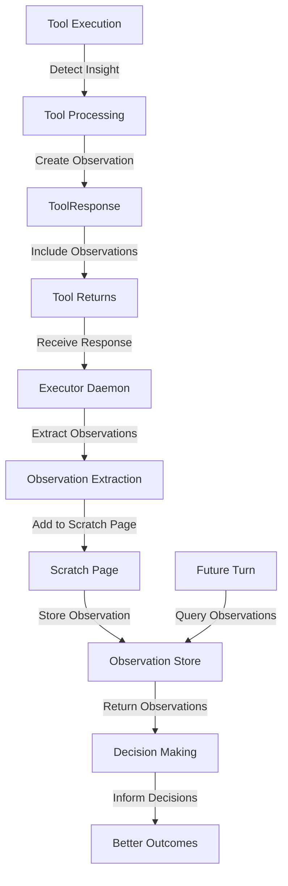

# Tools ↔ Scratch Page Integration

**Status:** Specification v1.0  
**Last Updated:** 2025-11-05  
**Priority:** MEDIUM (Observation Capture)

## Overview

This integration defines how tools add observations to the Scratch Page during execution, and how those observations inform future decisions. Tools can capture insights, alerts, and contextual information that persist across turns.

### Key Concepts

- **Tool**: External capability that executes actions (web search, API call, etc.)
- **Scratch Page**: Transient storage for observations and insights
- **Observation**: A single insight or alert from tool execution
- **ToolResponse**: Tool's response including observations
- **Confidence**: How confident the tool is in the observation

## Data Flow

### ASCII Diagram

```
Tool executes
  ↓
Tool detects insight/alert
  ↓
Tool adds observation to ToolResponse
  ↓
Tool returns ToolResponse
  ↓
Executor receives ToolResponse
  ↓
Executor extracts observations
  ↓
Executor adds to Scratch Page
  ↓
Future turns query Scratch Page
  ↓
Observations inform decisions
```

### Mermaid Diagram



## API Contracts

### Tool Response with Observations

```json
{
  "request_id": "req_20251105_001",
  "status": "ok",
  "outputs": {
    "forecast": {
      "location": "Paris",
      "temperature": 15,
      "condition": "cloudy"
    }
  },
  "observations": [
    {
      "type": "contextual_insight",
      "content": "Weather API returned data in 234ms",
      "confidence": 0.95,
      "tags": ["performance", "weather_api"],
      "ttl_minutes": 1440
    },
    {
      "type": "contextual_insight",
      "content": "Paris weather is typical for November",
      "confidence": 0.85,
      "tags": ["weather", "seasonal"],
      "ttl_minutes": 10080
    }
  ],
  "memory_writes": [],
  "scratch_page_writes": [
    {
      "type": "contextual_insight",
      "content": "User interested in Paris weather",
      "confidence": 0.9,
      "tags": ["user_interest", "weather"],
      "ttl_minutes": 2880
    }
  ]
}
```

### Observation Structure

```json
{
  "observation_id": "obs_20251105_001",
  "type": "contextual_insight",
  "content": "User prefers Burgundy wines",
  "confidence": 0.95,
  "tags": ["wine", "preference", "user_profile"],
  "source": {
    "tool": "wine_search",
    "turn_id": "turn_20251105_001",
    "timestamp": "2025-11-05T10:30:00Z"
  },
  "context": {
    "goal_id": "find_wine_recommendation",
    "user_id": "user_123"
  },
  "ttl_minutes": 1440,
  "expires_at": "2025-11-06T10:30:00Z"
}
```

## Decision Points

### 1. Observation Creation
**When:** Tool detects insight during execution  
**What:** Determine if insight should be captured  
**How:** Evaluate relevance and confidence  
**Result:** Observation created | Ignored

### 2. Confidence Assessment
**When:** Creating observation  
**What:** Assess confidence in observation  
**How:** Evaluate data quality and source reliability  
**Result:** Confidence score assigned

### 3. TTL Assignment
**When:** Creating observation  
**What:** Determine how long observation should persist  
**How:** Evaluate relevance duration  
**Result:** TTL assigned (minutes)

### 4. Tag Assignment
**When:** Creating observation  
**What:** Assign tags for future querying  
**How:** Categorize observation type  
**Result:** Tags assigned

## Concrete Examples

### Example 1: Tool Captures User Preference

```
Turn 1: User asks "What wine should I get?"

Tool Execution:
  1. Wine search tool executes
  2. Searches for wines matching criteria
  3. Finds: "2020 Marcel La Pierre - Burgundy"
  4. Detects insight: "User interested in Burgundy wines"
  5. Creates observation:
     - type: "contextual_insight"
     - content: "User prefers Burgundy wines"
     - confidence: 0.95
     - tags: ["wine", "preference", "user_profile"]
     - ttl_minutes: 2880 (2 days)
  6. Returns ToolResponse with observation

Executor Processing:
  1. Receives ToolResponse
  2. Extracts observation
  3. Adds to Scratch Page
  4. Logs to Turn Trace

Turn 2+:
  1. Future turns query Scratch Page
  2. Find observation: "User prefers Burgundy wines"
  3. Use in planning: "Recommend Burgundy wines"
  4. Better recommendations based on observation
```

### Example 2: Tool Captures Performance Metric

```
Turn 1: User asks "What's the weather?"

Tool Execution:
  1. Weather API tool executes
  2. Calls weather API
  3. Receives response in 234ms
  4. Detects insight: "API performance is good"
  5. Creates observation:
     - type: "contextual_insight"
     - content: "Weather API responded in 234ms"
     - confidence: 0.99
     - tags: ["performance", "weather_api"]
     - ttl_minutes: 1440 (1 day)
  6. Returns ToolResponse with observation

Executor Processing:
  1. Receives ToolResponse
  2. Extracts observation
  3. Adds to Scratch Page

Turn 2+:
  1. System Analyzer queries Scratch Page
  2. Finds performance observations
  3. Uses for optimization decisions
  4. May decide to use weather API more frequently
```

### Example 3: Tool Captures Alert

```
Turn 1: User asks "Check my email"

Tool Execution:
  1. Email tool executes
  2. Checks email
  3. Finds suspicious email from "bank"
  4. Detects alert: "Potential phishing email"
  5. Creates observation:
     - type: "alert"
     - content: "Suspicious email detected: sender claims to be bank"
     - confidence: 0.85
     - tags: ["security", "phishing", "alert"]
     - ttl_minutes: 10080 (7 days)
  6. Returns ToolResponse with observation

Executor Processing:
  1. Receives ToolResponse
  2. Extracts observation
  3. Adds to Scratch Page
  4. Logs to Turn Trace

Turn 2+:
  1. Router queries Scratch Page
  2. Finds alert: "Suspicious email detected"
  3. Increases urgency
  4. Prioritizes security check
  5. Warns user about phishing
```

### Example 4: Tool Captures Contextual Information

```
Turn 1: User asks "Book a flight to Paris"

Tool Execution:
  1. Flight search tool executes
  2. Searches for flights
  3. Finds flights available
  4. Detects context: "User traveling to Paris"
  5. Creates observation:
     - type: "contextual_insight"
     - content: "User planning trip to Paris"
     - confidence: 0.9
     - tags: ["travel", "destination", "paris"]
     - context: { goal_id: "book_flight_to_paris" }
     - ttl_minutes: 2880 (2 days)
  6. Returns ToolResponse with observation

Executor Processing:
  1. Receives ToolResponse
  2. Extracts observation
  3. Adds to Scratch Page

Turn 2+:
  1. Future turns see observation: "User planning trip to Paris"
  2. Can provide related recommendations:
     - Hotels in Paris
     - Weather in Paris
     - Things to do in Paris
  3. Better user experience through context awareness
```

## Error Handling

### Observation Storage Failure
**What:** Scratch Page storage fails  
**How:** Log error, continue tool execution  
**Recovery:** Retry on next turn

### Invalid Observation Format
**What:** Observation doesn't match schema  
**How:** Reject observation, log error  
**Recovery:** Tool should validate before sending

### Confidence Score Invalid
**What:** Confidence score out of range  
**How:** Clamp to valid range [0, 1]  
**Recovery:** Log warning, use clamped value

### TTL Invalid
**What:** TTL is negative or too large  
**How:** Use default TTL  
**Recovery:** Log warning, use default

## Related Integrations

- **[Scratch Page ↔ Frontal Cortex](scratch-page-frontal-cortex.md)** - Observations inform FC goal creation
- **[Daemons ↔ Scratch Page](daemons-scratch-page.md)** - Daemons also add observations
- **[Working Memory ↔ Frontal Cortex](working-memory-frontal-cortex.md)** - Observations inform context assembly

## Alignment with Si Core Tenants

- **Documentation-as-Code:** Integration fully specified; any implementation can follow the same observation format and storage logic
- **Tests-First:** Test conditions drive implementation of observation creation, storage, and querying
- **Modularity:** Tools and Scratch Page are separate; tool changes don't require Scratch Page code changes
- **Technology-Agnosticism:** Uses generic JSON observation format, not tied to specific technology

## Testing Considerations

### Test Scenario 1: Observation Creation
- **Setup:**
  - Tool executes: wine_search
  - Tool detects: "User prefers Burgundy wines"
  - Tool creates observation: `{type: "contextual_insight", content: "User prefers Burgundy wines", confidence: 0.95, tags: ["wine", "preference"]}`
- **Expected:** Observation created and stored
- **Acceptance Criteria:**
  - Observation created with unique observation_id
  - Observation stored in Scratch Page
  - All fields present and valid
  - Timestamp is accurate
- **Verification Steps:**
  1. Verify observation_id is unique
  2. Verify observation appears in Scratch Page
  3. Verify observation.type equals "contextual_insight"
  4. Verify observation.content is non-empty
  5. Verify observation.confidence equals 0.95
  6. Verify observation.tags includes "wine" and "preference"
- **Edge Cases:**
  - Observation with no tags
  - Observation with very long content
  - Observation with special characters

### Test Scenario 2: Confidence Assessment
- **Setup:**
  - Tool creates observations with different confidence levels:
    - Observation 1: confidence 0.99 (high)
    - Observation 2: confidence 0.75 (medium)
    - Observation 3: confidence 0.5 (low)
- **Expected:** Confidence values stored correctly
- **Acceptance Criteria:**
  - All confidence values stored
  - Confidence values in range [0, 1]
  - Confidence reflects data quality
- **Verification Steps:**
  1. Verify observation1.confidence equals 0.99
  2. Verify observation2.confidence equals 0.75
  3. Verify observation3.confidence equals 0.5
  4. Verify all values in valid range
  5. Verify confidence used for filtering
  6. Verify Turn Trace logs confidence values
- **Edge Cases:**
  - Confidence exactly 0 or 1
  - Confidence out of range (error case)
  - Confidence with many decimal places

### Test Scenario 3: TTL Assignment and Expiration
- **Setup:**
  - Tool creates observation: `{content: "...", ttl_minutes: 1}`
  - Wait 61 seconds
- **Expected:** Observation expires after TTL
- **Acceptance Criteria:**
  - Observation queryable before TTL
  - Observation not queryable after TTL
  - Expiration logged
- **Verification Steps:**
  1. Verify observation queryable at T=0
  2. Verify observation queryable at T=30s
  3. Wait until T=61s
  4. Verify observation not queryable
  5. Verify Turn Trace logs expiration
  6. Verify expires_at timestamp is accurate
- **Edge Cases:**
  - TTL of 0 (immediate expiration)
  - TTL of 10080 (7 days)
  - Query exactly at TTL boundary

### Test Scenario 4: Tag Assignment and Querying
- **Setup:**
  - Tool creates observations:
    - Obs 1: tags: ["wine", "preference"]
    - Obs 2: tags: ["wine", "budget"]
    - Obs 3: tags: ["travel", "destination"]
  - Query: `{tags: ["wine"]}`
- **Expected:** Only wine-tagged observations returned
- **Acceptance Criteria:**
  - Query returns 2 observations
  - Query excludes observation 3
  - Tags stored correctly
- **Verification Steps:**
  1. Verify query returns exactly 2 results
  2. Verify both results have "wine" tag
  3. Verify observation 3 not in results
  4. Verify tag filtering works
  5. Verify query time < 50ms
  6. Verify Turn Trace logs query
- **Edge Cases:**
  - Query with multiple tags (AND logic)
  - Query with no matching tags
  - Observation with no tags

### Test Scenario 5: Observation Persistence Across Turns
- **Setup:**
  - Turn 1: Tool creates observation: `{content: "User prefers Burgundy", ttl_minutes: 1440}`
  - Turn 2: Query for observation
- **Expected:** Observation available in Turn 2
- **Acceptance Criteria:**
  - Observation persists across turns
  - Observation queryable in Turn 2
  - TTL countdown continues
- **Verification Steps:**
  1. Verify observation created in Turn 1
  2. Verify observation queryable in Turn 1
  3. Turn 2 starts
  4. Verify observation still queryable in Turn 2
  5. Verify TTL countdown continues
  6. Verify Turn Trace logs persistence
- **Edge Cases:**
  - Observation expires between turns
  - Multiple observations persisting
  - Observation modified between turns

### Test Scenario 6: Multiple Observations from Single Tool
- **Setup:**
  - Tool returns ToolResponse with multiple observations:
    - Obs 1: "User prefers Burgundy"
    - Obs 2: "API response time: 234ms"
    - Obs 3: "User budget: $50"
- **Expected:** All observations stored
- **Acceptance Criteria:**
  - All 3 observations stored
  - Each has unique observation_id
  - All queryable
- **Verification Steps:**
  1. Verify 3 observations created
  2. Verify each has unique observation_id
  3. Verify all appear in Scratch Page
  4. Verify all queryable
  5. Verify Turn Trace logs all 3
  6. Verify no observations lost
- **Edge Cases:**
  - Tool returns 0 observations
  - Tool returns 100+ observations
  - Duplicate observations

### Test Scenario 7: Observation with Context
- **Setup:**
  - Tool creates observation: `{content: "...", context: {goal_id: "find_wine", user_id: "user_123"}}`
- **Expected:** Context stored and queryable
- **Acceptance Criteria:**
  - Context stored with observation
  - Context queryable
  - Context helps with filtering
- **Verification Steps:**
  1. Verify observation.context is stored
  2. Verify context.goal_id equals "find_wine"
  3. Verify context.user_id equals "user_123"
  4. Verify observations queryable by goal_id
  5. Verify observations queryable by user_id
  6. Verify Turn Trace logs context
- **Edge Cases:**
  - Observation with no context
  - Observation with nested context
  - Context with missing fields

