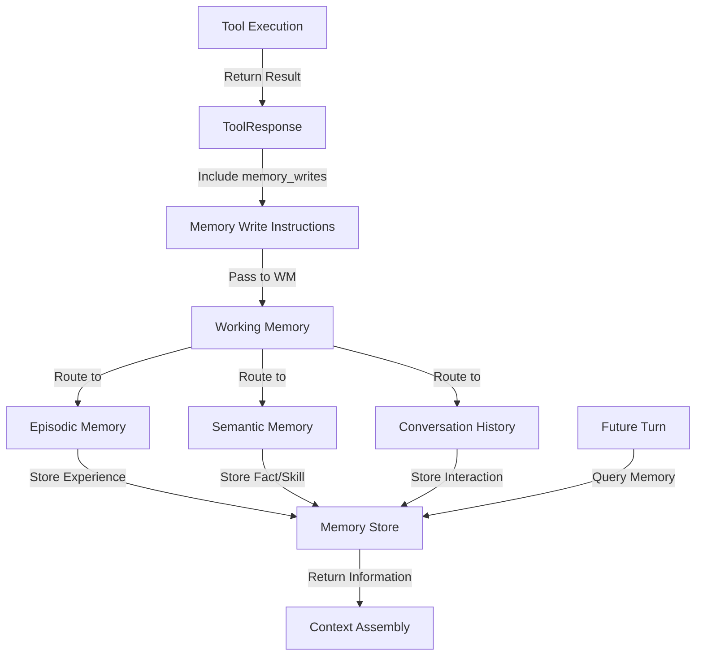

# Tools ↔ Working Memory Integration

**Status:** Specification v1.0  
**Last Updated:** 2025-11-05  
**Priority:** MEDIUM (Memory Ingestion)

## Overview

This integration defines how tool outputs are ingested into Working Memory systems (episodic memory, semantic memory, conversation history). Tool results become part of the knowledge base for future decision-making.

### Key Concepts

- **Tool Output**: Result from tool execution
- **Memory Write**: Instruction to store data in memory
- **Episodic Memory**: Specific experiences and outcomes
- **Semantic Memory**: General facts and skills
- **Conversation History**: Record of user interactions

## Data Flow

### ASCII Diagram

```
Tool executes
  ↓
Tool returns result
  ↓
Tool includes memory_writes in response
  ↓
Executor receives response
  ↓
Executor extracts memory_writes
  ↓
Executor passes to Working Memory
  ↓
Working Memory ingests into appropriate store
  ↓
Future turns access stored information
```

### Mermaid Diagram



## API Contracts

### Tool Response with Memory Writes

```json
{
  "request_id": "req_20251105_001",
  "status": "ok",
  "outputs": {
    "forecast": {
      "location": "Paris",
      "temperature": 15,
      "condition": "cloudy"
    }
  },
  "memory_writes": [
    {
      "type": "episodic",
      "content": "Called weather_api for Paris, received 15°C forecast",
      "tags": ["weather", "paris", "api_call"],
      "confidence": 0.99,
      "ttl_days": 30
    },
    {
      "type": "semantic",
      "content": "Weather API provides accurate forecasts for European cities",
      "tags": ["weather_api", "skill", "reliability"],
      "confidence": 0.95,
      "ttl_days": 365
    }
  ]
}
```

### Memory Write Structure

```json
{
  "type": "episodic",
  "content": "User asked about weather in Paris, received 15°C forecast",
  "tags": ["weather", "paris", "user_query"],
  "confidence": 0.99,
  "source": {
    "tool": "weather_api",
    "turn_id": "turn_20251105_001",
    "timestamp": "2025-11-05T10:30:00Z"
  },
  "ttl_days": 30,
  "context": {
    "goal_id": "answer_weather_query",
    "user_id": "user_123"
  }
}
```

## Decision Points

### 1. Memory Write Creation
**When:** Tool completes execution  
**What:** Determine what should be stored  
**How:** Evaluate relevance and durability  
**Result:** Memory write created | Skipped

### 2. Memory Type Selection
**When:** Creating memory write  
**What:** Determine which memory store  
**How:** Classify as episodic, semantic, or conversation  
**Result:** Memory type assigned

### 3. Confidence Assessment
**When:** Creating memory write  
**What:** Assess confidence in information  
**How:** Evaluate data quality and source  
**Result:** Confidence score assigned

### 4. TTL Assignment
**When:** Creating memory write  
**What:** Determine how long to store  
**How:** Evaluate information durability  
**Result:** TTL assigned

## Concrete Examples

### Example 1: Episodic Memory Write

```
Tool: weather_api

Execution:
  1. Calls weather API for Paris
  2. Receives: { temperature: 15, condition: "cloudy" }
  3. Creates memory write:
     - type: "episodic"
     - content: "Called weather_api for Paris, received 15°C"
     - tags: ["weather", "paris", "api_call"]
     - confidence: 0.99
     - ttl_days: 30

Working Memory:
  1. Receives memory write
  2. Stores in episodic memory
  3. Indexed by tags: ["weather", "paris"]
  4. Expires after 30 days

Future Turn:
  1. User asks: "What was the weather in Paris?"
  2. Working Memory queries episodic memory
  3. Finds: "Called weather_api for Paris, received 15°C"
  4. Includes in context
  5. Si can reference: "Earlier today, the weather was 15°C"
```

### Example 2: Semantic Memory Write

```
Tool: wine_search

Execution:
  1. Searches wine database
  2. Finds: "2020 Marcel La Pierre is highly rated"
  3. Creates memory write:
     - type: "semantic"
     - content: "2020 Marcel La Pierre is a highly-rated Burgundy wine"
     - tags: ["wine", "burgundy", "recommendation"]
     - confidence: 0.95
     - ttl_days: 365

Working Memory:
  1. Receives memory write
  2. Stores in semantic memory
  3. Indexed by tags: ["wine", "burgundy"]
  4. Expires after 365 days

Future Turn:
  1. User asks: "What Burgundy wines do you recommend?"
  2. Working Memory queries semantic memory
  3. Finds: "2020 Marcel La Pierre is highly-rated"
  4. Includes in context
  5. Si can recommend: "I recommend 2020 Marcel La Pierre"
```

### Example 3: Conversation History Write

```
Tool: email_reader

Execution:
  1. Reads email from user
  2. Extracts: "User mentioned budget of $50"
  3. Creates memory write:
     - type: "conversation"
     - content: "User mentioned budget constraint: $50"
     - tags: ["budget", "constraint", "user_preference"]
     - confidence: 0.99
     - ttl_days: 7

Working Memory:
  1. Receives memory write
  2. Stores in conversation history
  3. Indexed by tags: ["budget"]
  4. Expires after 7 days

Future Turn:
  1. User asks: "Find me a wine"
  2. Working Memory queries conversation history
  3. Finds: "User mentioned budget of $50"
  4. Includes in context
  5. Si can filter: "Wines under $50"
```

### Example 4: Multiple Memory Writes

```
Tool: flight_search

Execution:
  1. Searches for flights to Paris
  2. Finds: "Flights available, cheapest $200"
  3. Creates multiple memory writes:
     
     Write 1 (Episodic):
       - content: "Searched flights to Paris, found options"
       - ttl_days: 7
     
     Write 2 (Semantic):
       - content: "Flight search skill: can find flights by destination"
       - ttl_days: 365
     
     Write 3 (Conversation):
       - content: "User interested in Paris flights"
       - ttl_days: 30

Working Memory:
  1. Receives all three memory writes
  2. Stores in appropriate memory types
  3. All indexed and queryable

Future Turns:
  1. Can reference: "We searched for Paris flights earlier"
  2. Can use skill: "I can search for flights"
  3. Can remember: "You're interested in Paris"
```

## Error Handling

### Invalid Memory Write
**What:** Memory write doesn't match schema  
**How:** Reject write, log error  
**Recovery:** Tool should validate before sending

### Memory Storage Failure
**What:** Memory storage fails  
**How:** Log error, continue execution  
**Recovery:** Retry on next turn

### Confidence Score Invalid
**What:** Confidence out of range  
**How:** Clamp to valid range [0, 1]  
**Recovery:** Log warning, use clamped value

### TTL Invalid
**What:** TTL is negative or too large  
**How:** Use default TTL  
**Recovery:** Log warning, use default

## Related Integrations

- **[Working Memory ↔ Consciousness](working-memory-consciousness.md)** - Memory queries consciousness during context assembly
- **[Working Memory ↔ Frontal Cortex](working-memory-frontal-cortex.md)** - Memory provides context to FC
- **[Tools ↔ Scratch Page](tools-scratch-page.md)** - Tools also add observations to Scratch Page

## Alignment with Si Core Tenants

- **Documentation-as-Code:** Integration fully specified; any implementation can follow the same memory write logic
- **Tests-First:** Test conditions drive implementation of memory storage and retrieval
- **Modularity:** Tools and Working Memory are separate; tool changes don't require memory code changes
- **Technology-Agnosticism:** Uses generic JSON memory format, not tied to specific technology

## Testing Considerations

### Test Scenario 1: Episodic Memory Write
- **Setup:**
  - Tool executes: weather_api
  - Tool returns: `{memory_writes: [{type: "episodic", content: "Weather query for Paris returned 15°C", confidence: 0.95, tags: ["weather", "paris"]}]}`
- **Expected:** Data stored in episodic memory
- **Acceptance Criteria:**
  - Memory written with unique memory_id
  - Memory stored in episodic memory
  - All fields present and valid
  - Data queryable in future turns
- **Verification Steps:**
  1. Verify memory_id is unique
  2. Verify memory appears in episodic store
  3. Verify memory.type equals "episodic"
  4. Verify memory.content is non-empty
  5. Verify memory.confidence equals 0.95
  6. Verify memory queryable in future turns
- **Edge Cases:**
  - Memory with no tags
  - Memory with very long content
  - Memory with special characters

### Test Scenario 2: Semantic Memory Write
- **Setup:**
  - Tool executes: wine_search
  - Tool returns: `{memory_writes: [{type: "semantic", content: "Burgundy wines are preferred by user", confidence: 0.9, tags: ["wine", "preference"]}]}`
- **Expected:** Data stored in semantic memory
- **Acceptance Criteria:**
  - Memory written with unique memory_id
  - Memory stored in semantic memory
  - Memory is generalizable
  - Data persists across turns
- **Verification Steps:**
  1. Verify memory_id is unique
  2. Verify memory appears in semantic store
  3. Verify memory.type equals "semantic"
  4. Verify memory.content is generalizable
  5. Verify memory persists across turns
  6. Verify memory queryable in future turns
- **Edge Cases:**
  - Semantic memory with low confidence
  - Semantic memory with conflicting information
  - Semantic memory with no tags

### Test Scenario 3: Conversation History Write
- **Setup:**
  - Tool executes: conversation_logger
  - Tool returns: `{memory_writes: [{type: "conversation", content: "User asked about weather", role: "user", confidence: 1.0}]}`
- **Expected:** Data stored in conversation history
- **Acceptance Criteria:**
  - Memory written with unique memory_id
  - Memory stored in conversation history
  - Role captured (user/assistant)
  - Data available for context assembly
- **Verification Steps:**
  1. Verify memory_id is unique
  2. Verify memory appears in conversation history
  3. Verify memory.type equals "conversation"
  4. Verify memory.role equals "user"
  5. Verify memory available for context assembly
  6. Verify conversation queryable in order
- **Edge Cases:**
  - Conversation with no role
  - Conversation with very long content
  - Conversation with media

### Test Scenario 4: Multiple Memory Writes
- **Setup:**
  - Tool returns multiple memory writes:
    - Write 1: episodic memory
    - Write 2: semantic memory
    - Write 3: conversation history
- **Expected:** All writes stored
- **Acceptance Criteria:**
  - All 3 memories stored
  - Each has unique memory_id
  - All queryable
- **Verification Steps:**
  1. Verify 3 memories created
  2. Verify each has unique memory_id
  3. Verify episodic memory stored
  4. Verify semantic memory stored
  5. Verify conversation history stored
  6. Verify all data queryable
- **Edge Cases:**
  - Tool returns 0 memory writes
  - Tool returns 100+ memory writes
  - Duplicate memory writes

### Test Scenario 5: TTL Enforcement
- **Setup:**
  - Tool returns: `{memory_writes: [{type: "episodic", content: "...", ttl_minutes: 1}]}`
  - Wait 61 seconds
- **Expected:** Data expires after TTL
- **Acceptance Criteria:**
  - Memory queryable before TTL
  - Memory not queryable after TTL
  - Expiration logged
- **Verification Steps:**
  1. Verify memory queryable at T=0
  2. Verify memory queryable at T=30s
  3. Wait until T=61s
  4. Verify memory not queryable
  5. Verify Turn Trace logs expiration
  6. Verify expires_at timestamp is accurate
- **Edge Cases:**
  - TTL of 0 (immediate expiration)
  - TTL of 10080 (7 days)
  - Query exactly at TTL boundary

### Test Scenario 6: Confidence Filtering
- **Setup:**
  - Query memory with confidence threshold: >= 0.8
  - Memory store contains:
    - Memory 1: confidence 0.95
    - Memory 2: confidence 0.75
    - Memory 3: confidence 0.85
- **Expected:** Only high-confidence data returned
- **Acceptance Criteria:**
  - Query returns 2 memories (1 and 3)
  - Query excludes memory 2
  - Filtering works correctly
- **Verification Steps:**
  1. Verify query returns exactly 2 results
  2. Verify memory 1 (0.95) in results
  3. Verify memory 3 (0.85) in results
  4. Verify memory 2 (0.75) not in results
  5. Verify filtering threshold respected
  6. Verify Turn Trace logs filtering
- **Edge Cases:**
  - Confidence exactly at threshold
  - All memories below threshold
  - All memories above threshold

### Test Scenario 7: Tag-Based Querying
- **Setup:**
  - Memory store contains:
    - Memory 1: tags: ["weather", "paris"]
    - Memory 2: tags: ["weather", "london"]
    - Memory 3: tags: ["wine", "burgundy"]
  - Query: `{tags: ["weather"]}`
- **Expected:** Data queryable by tag
- **Acceptance Criteria:**
  - Query returns 2 memories
  - Query excludes memory 3
  - Tag filtering works correctly
- **Verification Steps:**
  1. Verify query returns exactly 2 results
  2. Verify both results have "weather" tag
  3. Verify memory 3 not in results
  4. Verify query time < 50ms
  5. Verify pagination works for large result sets
  6. Verify Turn Trace logs query
- **Edge Cases:**
  - Query with multiple tags (AND logic)
  - Query with no matching tags
  - Query with empty tag list

