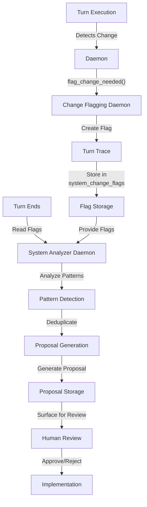

# Turn Trace ↔ System Change Proposals Integration

**Status:** v1.0 (Stable)
**Last Updated:** 2025-11-07
**Priority:** HIGH (System Improvement)

## Overview

This integration defines how Turn Trace flags feed into System Change Proposals. During turn execution, daemons flag changes needed; after turn execution, System Analyzer processes flags to generate improvement proposals for human review.

### Key Concepts

- **Turn Trace**: Write-only audit log during turn execution, read-only analysis log after
- **Flag**: A marker indicating a change is needed (created during turn execution)
- **System Analyzer**: Daemon that processes flags to generate proposals
- **Proposal**: A documented improvement suggestion with evidence
- **Change Flagging Daemon**: Monitors turn execution and creates flags

## Data Flow

### ASCII Diagram

```
Turn Execution
  ↓
Daemon detects change needed
  ↓
Daemon calls flag_change_needed()
  ↓
Change Flagging Daemon creates flag
  ↓
Flag stored in turn_trace.system_change_flags
  ↓
Turn ends
  ↓
System Analyzer reads turn trace
  ↓
Analyzer processes flags
  ↓
Analyzer generates proposals
  ↓
Proposals surfaced for human review
```

### Mermaid Diagram



## API Contracts

### Request: Daemon Flags Change

```json
{
  "flag_type": "new_action_type",
  "severity": "info",
  "rationale": "Current action types don't support parallel execution",
  "details": {
    "action_type_name": "parallel_task",
    "description": "Execute multiple tasks in parallel",
    "reason": "User asked to run 5 research tasks simultaneously",
    "suggested_policies": {
      "requires_confirmation": false,
      "auto_complete": true
    }
  },
  "evidence": {
    "turn_id": "turn_20251105_001",
    "user_id": "user_123",
    "action_attempted": "parallel_research",
    "error_message": "Action type 'parallel_task' not found"
  }
}
```

### Response: Flag Created

```json
{
  "flag_id": "flag_20251105_001",
  "flag_type": "new_action_type",
  "status": "created",
  "timestamp": "2025-11-05T10:30:00Z",
  "stored_in_turn_trace": true
}
```

### Request: System Analyzer Queries Flags

```json
{
  "query": "Get all flags from last 7 days",
  "metadata": {
    "time_range": "7_days",
    "flag_types": ["new_action_type", "new_tool", "tool_enhancement"],
    "min_severity": "info"
  }
}
```

### Response: Flags Retrieved

```json
{
  "flags": [
    {
      "flag_id": "flag_20251105_001",
      "flag_type": "new_action_type",
      "severity": "info",
      "count": 3,
      "first_occurrence": "2025-11-03T14:22:00Z",
      "last_occurrence": "2025-11-05T10:30:00Z",
      "details": {
        "action_type_name": "parallel_task"
      }
    }
  ],
  "total_count": 1,
  "query_time_ms": 156
}
```

### Request: System Analyzer Creates Proposal

```json
{
  "proposal_type": "new_action_type",
  "title": "Add parallel_task action type",
  "description": "Support executing multiple tasks in parallel",
  "rationale": "Multiple users have requested parallel execution capability",
  "evidence": {
    "flag_ids": ["flag_20251105_001", "flag_20251104_002"],
    "occurrence_count": 3,
    "time_span_days": 2
  },
  "suggested_documentation": {
    "action_type_name": "parallel_task",
    "description": "Execute multiple tasks in parallel",
    "parameters": ["tasks", "max_parallel"],
    "policies": ["requires_confirmation", "auto_complete"]
  }
}
```

## Decision Points

### 1. Flag Creation
**When:** Daemon detects change needed  
**What:** Determine if flag should be created  
**How:** Evaluate severity and relevance  
**Result:** Flag created | Ignored

### 2. Flag Deduplication
**When:** System Analyzer processes flags  
**What:** Identify duplicate flags  
**How:** Compare flag_type and details  
**Result:** Flags grouped by type

### 3. Pattern Detection
**When:** Multiple flags of same type  
**What:** Determine if pattern indicates real need  
**How:** Analyze frequency and time span  
**Result:** Pattern detected | Noise

### 4. Proposal Generation
**When:** Pattern detected  
**What:** Generate improvement proposal  
**How:** Combine evidence from multiple flags  
**Result:** Proposal created for review

## Concrete Examples

### Example 1: Single Flag → Proposal

```
Turn 1:
  1. Frontal Cortex attempts: "parallel_task" action
  2. Action type not found
  3. FC calls flag_change_needed():
     - flag_type: "new_action_type"
     - details: { action_type_name: "parallel_task" }
  4. Flag stored in turn trace

Turn 2-3:
  1. System Analyzer reads turn traces
  2. Finds flag: "new_action_type" for "parallel_task"
  3. Checks for duplicates: Found 1 occurrence
  4. Evaluates: "Single occurrence, but high-value feature"
  5. Generates proposal: "Add parallel_task action type"
  6. Proposal surfaced for human review

Human Review:
  1. Reviews proposal with evidence
  2. Approves: "Yes, add parallel_task"
  3. Proposal → Implementation
  4. New action type added to registry
```

### Example 2: Multiple Flags → Proposal

```
Turn 1-5:
  1. Multiple users attempt: "parallel_task" action
  2. Each time: Action type not found
  3. Each time: Flag created
  4. Flags stored in turn traces

System Analyzer (after 5 turns):
  1. Reads turn traces
  2. Finds 5 flags: "new_action_type" for "parallel_task"
  3. Deduplicates: All same type
  4. Analyzes pattern:
     - Occurrence count: 5
     - Time span: 2 days
     - Severity: info
  5. Evaluates: "Clear pattern, multiple users need this"
  6. Generates proposal: "Add parallel_task action type"
  7. Includes evidence: 5 flags, 2-day span, multiple users

Human Review:
  1. Reviews proposal with strong evidence
  2. Approves: "Yes, add parallel_task"
  3. Proposal → Implementation
  4. New action type added to registry
```

### Example 3: Tool Enhancement Proposal

```
Turn 1-3:
  1. Tool "weather_api" returns incomplete data
  2. Daemon flags: "tool_enhancement"
  3. Details: "weather_api needs humidity data"
  4. Flags stored in turn traces

System Analyzer (after 3 turns):
  1. Finds 3 flags: "tool_enhancement" for "weather_api"
  2. Deduplicates: All same enhancement
  3. Analyzes: "Consistent request for humidity data"
  4. Generates proposal: "Enhance weather_api with humidity"
  5. Includes evidence: 3 flags, specific enhancement request

Human Review:
  1. Reviews proposal
  2. Approves: "Yes, add humidity to weather_api"
  3. Proposal → Implementation
  4. Tool updated with humidity data
```

## Error Handling

### Flag Creation Failure
**What:** Flag creation fails  
**How:** Log error, continue turn execution  
**Recovery:** Retry flag creation on next turn

### Flag Storage Failure
**What:** Turn trace storage fails  
**How:** Log error, flag is lost  
**Recovery:** Implement retry logic, alert on repeated failures

### System Analyzer Timeout
**What:** System Analyzer query times out  
**How:** Retry with simpler query  
**Recovery:** Process flags in smaller batches

### Proposal Generation Failure
**What:** Proposal generation fails  
**How:** Log error, skip proposal  
**Recovery:** Investigate and fix generation logic

## Related Integrations

- **[Consciousness ↔ Frontal Cortex](consciousness-frontal-cortex.md)** - FC decisions logged to turn trace for analysis
- **[Working Memory ↔ Frontal Cortex](working-memory-frontal-cortex.md)** - Outcomes logged to turn trace for learning
- **[LLM Budget System ↔ Turn Architecture](llm-budget-system-turn.md)** - Budget consumption tracked in turn trace

## Alignment with Si Core Tenants

- **Documentation-as-Code:** Integration fully specified; any implementation can follow the same flag-to-proposal logic
- **Tests-First:** Test conditions drive implementation of flag creation, deduplication, and proposal generation
- **Modularity:** Turn Trace and System Change Proposals are separate; flag format is independent
- **Technology-Agnosticism:** Uses generic JSON flag format, not tied to specific technology

## Testing Considerations

### Test Scenario 1: Single Flag Creation
- **Setup:**
  - Daemon detects: "Action type 'parallel_task' not found"
  - Daemon calls: `flag_change_needed({flag_type: "new_action_type", severity: "info", details: {action_type_name: "parallel_task"}})`
- **Expected:** Flag created and stored in turn trace
- **Acceptance Criteria:**
  - Flag created with unique flag_id
  - Flag stored in turn_trace.system_change_flags
  - Flag includes all provided details
  - Timestamp is accurate
- **Verification Steps:**
  1. Verify flag_id is unique and non-empty
  2. Verify flag appears in turn trace
  3. Verify flag.flag_type equals "new_action_type"
  4. Verify flag.severity equals "info"
  5. Verify flag.details.action_type_name equals "parallel_task"
  6. Verify Turn Trace logs flag creation
- **Edge Cases:**
  - Flag creation during high-load
  - Flag with missing optional fields
  - Flag with very large details object

### Test Scenario 2: Flag Deduplication
- **Setup:**
  - Turn 1: Create flag: `{flag_type: "new_action_type", details: {action_type_name: "parallel_task"}}`
  - Turn 2: Create identical flag
  - Turn 3: Create identical flag
  - System Analyzer queries flags
- **Expected:** Flags grouped together, deduplication works
- **Acceptance Criteria:**
  - All 3 flags stored separately
  - Deduplication identifies them as identical
  - Grouped count shows 3 occurrences
  - Deduplication doesn't lose data
- **Verification Steps:**
  1. Verify all 3 flags stored in turn trace
  2. Verify deduplication identifies all 3 as same type
  3. Verify deduplication.count equals 3
  4. Verify deduplication.first_occurrence is earliest
  5. Verify deduplication.last_occurrence is latest
  6. Verify Turn Trace logs deduplication
- **Edge Cases:**
  - Nearly identical flags (small differences)
  - Flags with different severity levels
  - Flags from different users

### Test Scenario 3: Pattern Detection
- **Setup:**
  - Create 5 flags of type "new_action_type" for "parallel_task"
  - Time span: 2 days
  - System Analyzer analyzes flags
- **Expected:** Pattern detected
- **Acceptance Criteria:**
  - Pattern detected with confidence >= 0.8
  - Pattern includes all 5 flags
  - Time span calculated correctly
  - Pattern marked as "significant"
- **Verification Steps:**
  1. Verify pattern.flag_count equals 5
  2. Verify pattern.time_span_days equals 2
  3. Verify pattern.confidence >= 0.8
  4. Verify pattern.significance equals "high"
  5. Verify pattern.flag_ids includes all 5 IDs
  6. Verify Turn Trace logs pattern detection
- **Edge Cases:**
  - Single flag (no pattern)
  - Flags spread over long time period
  - Flags with varying severity

### Test Scenario 4: Proposal Generation
- **Setup:**
  - Pattern detected: 5 flags for "parallel_task"
  - System Analyzer generates proposal
- **Expected:** Proposal generated with evidence
- **Acceptance Criteria:**
  - Proposal created with unique proposal_id
  - Proposal includes all flag IDs
  - Proposal includes pattern analysis
  - Proposal is actionable
- **Verification Steps:**
  1. Verify proposal_id is unique
  2. Verify proposal.flag_ids includes all 5 flags
  3. Verify proposal.pattern_analysis is present
  4. Verify proposal.suggested_action is non-empty
  5. Verify proposal.evidence_strength >= 0.8
  6. Verify Turn Trace logs proposal generation
- **Edge Cases:**
  - Proposal with conflicting evidence
  - Proposal with no clear action
  - Proposal with multiple possible actions

### Test Scenario 5: Proposal with Complete Evidence
- **Setup:**
  - Create 3 flags for "new_action_type"
  - Generate proposal
  - Verify evidence completeness
- **Expected:** Proposal includes all evidence
- **Acceptance Criteria:**
  - Proposal includes: flag_ids, occurrence_count, time_span, user_count
  - Evidence is complete and accurate
  - Evidence supports recommendation
- **Verification Steps:**
  1. Verify proposal.evidence.flag_ids.length equals 3
  2. Verify proposal.evidence.occurrence_count equals 3
  3. Verify proposal.evidence.time_span_days is calculated
  4. Verify proposal.evidence.user_count is accurate
  5. Verify proposal.evidence.first_occurrence timestamp
  6. Verify proposal.evidence.last_occurrence timestamp
- **Edge Cases:**
  - Evidence with missing data
  - Evidence from single user
  - Evidence spanning multiple weeks

### Test Scenario 6: Noise Filtering
- **Setup:**
  - Create 1 flag with severity: "debug"
  - Create 1 flag with severity: "info"
  - System Analyzer filters with min_severity: "warning"
- **Expected:** Low-severity flags filtered out
- **Acceptance Criteria:**
  - Debug and info flags excluded
  - No proposal generated for low-severity flags
  - Filtering threshold respected
- **Verification Steps:**
  1. Verify debug flag not included in analysis
  2. Verify info flag not included in analysis
  3. Verify no proposal generated
  4. Verify Turn Trace logs filtering
  5. Verify flags still stored (not deleted)
  6. Verify filtering threshold configurable
- **Edge Cases:**
  - Flag exactly at threshold
  - All flags below threshold
  - Threshold change during analysis

### Test Scenario 7: Time-Based Filtering
- **Setup:**
  - Create flags:
    - Flag 1: 10 days ago
    - Flag 2: 5 days ago
    - Flag 3: 1 day ago
  - System Analyzer queries: last 7 days
- **Expected:** Only recent flags included
- **Acceptance Criteria:**
  - Flag 1 (10 days) excluded
  - Flag 2 (5 days) included
  - Flag 3 (1 day) included
  - Time filtering accurate
- **Verification Steps:**
  1. Verify Flag 1 not in results
  2. Verify Flag 2 in results
  3. Verify Flag 3 in results
  4. Verify query_time_range equals 7 days
  5. Verify Turn Trace logs time filtering
  6. Verify time filtering boundary accurate
- **Edge Cases:**
  - Flag exactly at boundary (7 days)
  - All flags outside time range
  - Time range of 0 days

