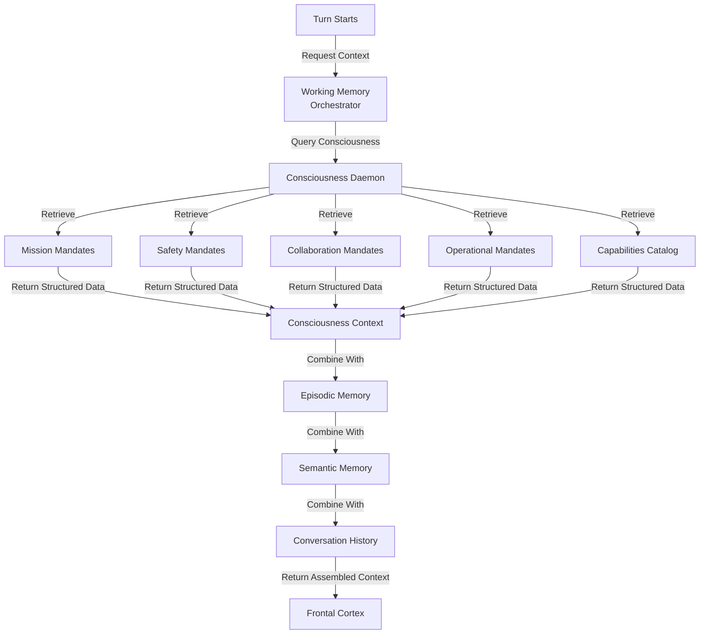

# Working Memory ↔ Consciousness Integration

**Status:** Specification v1.0  
**Last Updated:** 2025-11-05  
**Priority:** HIGH (Context Assembly)

## Overview

This integration defines how Working Memory queries Consciousness during context assembly to retrieve mandates, capabilities, and governance rules. Consciousness provides the "who we are" context that informs all decision-making.

### Key Concepts

- **Working Memory**: Current context, conversation history, turn trace
- **Consciousness**: Si's values, mandates, identity, capabilities, governance
- **Context Assembly**: Process of gathering relevant information for decision-making
- **Mandate**: A rule or constraint that guides behavior
- **Capability**: Something Si can do or understand

## Data Flow

### ASCII Diagram

```
Turn starts
  ↓
Frontal Cortex requests context assembly
  ↓
Working Memory begins assembly
  ↓
WM queries Consciousness: "What mandates apply?"
  ↓
Consciousness returns mandates + capabilities
  ↓
WM combines with episodic/semantic memory
  ↓
WM returns assembled context
  ↓
Frontal Cortex uses context for planning
```

### Mermaid Diagram



## API Contracts

### Request: WM Queries Consciousness

```json
{
  "query": "What mandates and capabilities apply to this situation?",
  "metadata": {
    "context": "user_request",
    "mode": "normal",
    "urgency": "medium",
    "categories": ["mission", "safety", "collaboration"]
  },
  "data": {
    "current_mode": "normal",
    "user_id": "user_123",
    "conversation_topic": "wine_recommendation"
  }
}
```

### Response: Consciousness Returns Context

```json
{
  "mandates": [
    {
      "mandate_id": "mission_001",
      "category": "mission",
      "mandate": "Help users make informed decisions",
      "rationale": "Core mission of Si",
      "applies_to_current_context": true,
      "priority": "high"
    },
    {
      "mandate_id": "safety_001",
      "category": "safety",
      "mandate": "Protect user privacy",
      "rationale": "User data is sensitive",
      "applies_to_current_context": true,
      "priority": "critical"
    },
    {
      "mandate_id": "collaboration_001",
      "category": "collaboration",
      "mandate": "Respect user autonomy",
      "rationale": "User makes final decisions",
      "applies_to_current_context": true,
      "priority": "high"
    }
  ],
  "capabilities": [
    {
      "capability_id": "cap_001",
      "name": "web_search",
      "description": "Search the web for information",
      "constraints": ["rate_limited", "requires_user_consent"],
      "applies_to_current_context": true
    },
    {
      "capability_id": "cap_002",
      "name": "wine_database_search",
      "description": "Search wine database",
      "constraints": ["internal_only"],
      "applies_to_current_context": true
    }
  ],
  "governance_rules": [
    {
      "rule_id": "gov_001",
      "rule": "All external API calls must be logged",
      "applies_to_current_context": true
    }
  ],
  "timestamp": "2025-11-05T10:30:00Z",
  "query_time_ms": 23
}
```

### Request: WM Queries Specific Mandate Category

```json
{
  "query": "What safety mandates apply?",
  "metadata": {
    "category": "safety",
    "mode": "normal"
  }
}
```

### Response: Filtered Mandates

```json
{
  "mandates": [
    {
      "mandate_id": "safety_001",
      "mandate": "Protect user privacy",
      "details": "Do not share user data with third parties"
    },
    {
      "mandate_id": "safety_002",
      "mandate": "Verify external services",
      "details": "Only use trusted external services"
    }
  ],
  "count": 2
}
```

## Decision Points

### 1. Context Assembly Trigger
**When:** Turn starts or Frontal Cortex requests context  
**What:** Determine what context is needed  
**How:** Analyze stimulus and current mode  
**Result:** Query Consciousness for relevant mandates

### 2. Mandate Selection
**When:** Consciousness returns mandates  
**What:** Filter mandates relevant to current context  
**How:** Use metadata (mode, urgency, topic)  
**Result:** Selected mandates included in context

### 3. Capability Matching
**When:** Planning phase  
**What:** Match available capabilities to task  
**How:** Check capabilities returned by Consciousness  
**Result:** Capabilities available for planning

### 4. Constraint Application
**When:** Planning actions  
**What:** Apply governance rules and constraints  
**How:** Use rules from Consciousness response  
**Result:** Actions comply with constraints

## Concrete Examples

### Example 1: Standard Context Assembly

```
Turn 1: User asks "What wine should I get?"

Working Memory Assembly:
  1. Receives request: assemble_context(prompt="wine_recommendation")
  2. Queries Consciousness: "What mandates apply to wine recommendations?"
  
Consciousness Response:
  - Mission: "Help users make informed decisions"
  - Safety: "Protect user privacy"
  - Collaboration: "Respect user autonomy"
  - Capabilities: "web_search", "wine_database_search"

Working Memory Assembly (continued):
  3. Combines Consciousness context with:
     - Episodic memory: "User previously liked Burgundy wines"
     - Semantic memory: "Wine recommendation skill"
     - Conversation history: "User mentioned budget: $50"
  4. Returns assembled context to Frontal Cortex

Frontal Cortex Planning:
  1. Receives context with mandates and capabilities
  2. Plans: "Search wine database for Burgundy wines under $50"
  3. Checks against mandates: All satisfied
  4. Executes plan
```

### Example 2: Safety Mandate Application

```
Turn 2: User asks "Can you contact my bank?"

Working Memory Assembly:
  1. Queries Consciousness: "What mandates apply to external contacts?"
  
Consciousness Response:
  - Safety: "Verify external services before contact"
  - Safety: "Require user confirmation for sensitive contacts"
  - Collaboration: "Respect user autonomy"

Working Memory Assembly (continued):
  2. Includes safety mandates in context
  3. Returns context with explicit safety constraints

Frontal Cortex Planning:
  1. Receives context with safety mandates
  2. Plans: "Request user confirmation before contacting bank"
  3. Checks against mandates: All satisfied
  4. Requests confirmation from user
  5. Only contacts bank after user confirms
```

### Example 3: Capability-Constrained Planning

```
Turn 3: User asks "Search for flights to Paris"

Working Memory Assembly:
  1. Queries Consciousness: "What capabilities do I have for flight search?"
  
Consciousness Response:
  - Capability: "web_search" (rate_limited, requires_user_consent)
  - Capability: "flight_database_search" (internal_only)
  - Governance: "All external API calls must be logged"

Working Memory Assembly (continued):
  2. Includes capabilities and constraints in context
  3. Returns context with available options

Frontal Cortex Planning:
  1. Receives context with capabilities
  2. Plans: "Use flight_database_search (internal, no rate limit)"
  3. Checks constraints: Logging required
  4. Executes search with logging
```

## Error Handling

### Consciousness Query Timeout
**What:** Consciousness query times out  
**How:** Return default mandates (conservative)  
**Recovery:** Retry on next turn, log error

### Missing Mandate
**What:** Consciousness doesn't have mandate for situation  
**How:** Return empty mandate list, proceed with caution  
**Recovery:** Add mandate to Consciousness, retry

### Conflicting Mandates
**What:** Multiple mandates give conflicting guidance  
**How:** Return all mandates, let Frontal Cortex decide  
**Recovery:** Clarify mandates in Consciousness

### Capability Not Available
**What:** Consciousness returns capability but it's not available  
**How:** Log error, plan without that capability  
**Recovery:** Update Consciousness, retry

## Related Integrations

- **[Consciousness ↔ Frontal Cortex](consciousness-frontal-cortex.md)** - FC uses mandates from consciousness for action validation
- **[Working Memory ↔ Frontal Cortex](working-memory-frontal-cortex.md)** - Assembled context with mandates passed to FC for planning
- **[Tools ↔ Working Memory](tools-working-memory.md)** - Tool outputs ingested into memory alongside consciousness context
- **[Turn Trace ↔ System Change Proposals](turn-trace-system-change-proposals.md)** - Context assembly decisions logged for analysis

## Alignment with Si Core Tenants

- **Documentation-as-Code:** Integration fully specified; any implementation can follow the same context assembly logic
- **Tests-First:** Test conditions drive implementation of mandate retrieval and context assembly
- **Modularity:** WM and Consciousness are separate; mandate changes don't require WM code changes
- **Technology-Agnosticism:** Uses generic JSON contracts for mandates and capabilities

## Testing Considerations

### Test Scenario 1: Standard Context Assembly
- **Setup:**
  - Turn starts with prompt: "answer_weather_query"
  - Budget: 2000 tokens
  - Mode: "normal"
- **Expected:** WM assembles context with mandates and capabilities
- **Acceptance Criteria:**
  - Context includes mission, safety, collaboration mandates
  - Context includes relevant capabilities
  - Budget_remaining is accurate
  - Response time < 200ms
- **Verification Steps:**
  1. Verify context.mandates array is non-empty
  2. Verify context.capabilities array is non-empty
  3. Verify context.budget_remaining = 2000 - consumed
  4. Verify all mandate categories present
  5. Verify Turn Trace logs context assembly
  6. Verify context includes episodic and semantic memory
- **Edge Cases:**
  - Empty mandate list
  - No matching capabilities
  - Budget exactly consumed

### Test Scenario 2: Filtered Mandates by Category
- **Setup:**
  - WM queries: `{query: "What safety mandates apply?", metadata: {category: "safety"}}`
  - Consciousness has: 3 safety, 2 mission, 2 collaboration mandates
- **Expected:** Only safety mandates returned
- **Acceptance Criteria:**
  - Response includes exactly 3 mandates
  - All returned mandates have category: "safety"
  - No mission or collaboration mandates included
- **Verification Steps:**
  1. Verify response.mandates.length == 3
  2. Verify all mandates have category: "safety"
  3. Verify mission mandates not in response
  4. Verify collaboration mandates not in response
  5. Verify Turn Trace logs filtered query
  6. Verify filtering doesn't affect other categories
- **Edge Cases:**
  - Category with no mandates
  - Multiple categories requested
  - Invalid category name

### Test Scenario 3: Capability Matching
- **Setup:**
  - WM queries: `{query: "What capabilities for weather query?", metadata: {task: "weather_query"}}`
  - Consciousness has: web_search, weather_api, wine_database_search capabilities
- **Expected:** Only weather-relevant capabilities returned
- **Acceptance Criteria:**
  - Response includes: web_search, weather_api
  - Response excludes: wine_database_search
  - Capabilities include constraints
- **Verification Steps:**
  1. Verify response.capabilities includes weather_api
  2. Verify response.capabilities includes web_search
  3. Verify wine_database_search not in response
  4. Verify each capability has constraints array
  5. Verify capability descriptions are accurate
  6. Verify Turn Trace logs capability query
- **Edge Cases:**
  - No matching capabilities
  - Multiple matching capabilities
  - Capability with no constraints

### Test Scenario 4: Constraint Application
- **Setup:**
  - WM assembles context with constraints:
    - "All external API calls must be logged"
    - "Rate limit: 1 call per second"
  - FC receives context and plans action
- **Expected:** FC respects constraints in planning
- **Acceptance Criteria:**
  - FC includes logging in action plan
  - FC respects rate limit in scheduling
  - Constraints appear in Turn Trace
- **Verification Steps:**
  1. Verify context.governance_rules includes logging rule
  2. Verify context.governance_rules includes rate limit
  3. Verify FC plan includes logging
  4. Verify FC plan respects rate limit
  5. Verify Turn Trace logs constraint application
  6. Verify action execution follows constraints
- **Edge Cases:**
  - Conflicting constraints
  - Constraint with no implementation
  - Constraint violation detected

### Test Scenario 5: Timeout Handling
- **Setup:**
  - Configure consciousness query timeout: 100ms
  - Create slow consciousness (500ms response)
  - WM requests context assembly
- **Expected:** WM returns default context after timeout
- **Acceptance Criteria:**
  - Query times out after 100ms
  - WM returns conservative default mandates
  - Error logged with timestamp
  - System continues without crashing
- **Verification Steps:**
  1. Verify query times out at 100ms
  2. Verify default mandates returned (conservative)
  3. Verify error log contains: query_id, timeout_ms, timestamp
  4. Verify WM continues with degraded context
  5. Verify Turn Trace logs timeout
  6. Verify system state is consistent
- **Edge Cases:**
  - Multiple timeouts in sequence
  - Timeout during high-urgency request
  - Timeout with partial response

### Test Scenario 6: Mode-Specific Mandates
- **Setup:**
  - Mode: "normal" - standard mandates
  - Mode: "emergency" - relaxed constraints
  - Mode: "restricted" - strict constraints
- **Expected:** Different mandates for different modes
- **Acceptance Criteria:**
  - Normal mode: standard mandate set
  - Emergency mode: fewer constraints
  - Restricted mode: more constraints
- **Verification Steps:**
  1. Query with mode: "normal", verify standard mandates
  2. Query with mode: "emergency", verify relaxed mandates
  3. Query with mode: "restricted", verify strict mandates
  4. Verify mandate counts differ by mode
  5. Verify Turn Trace logs mode-specific selection
  6. Verify mode affects capability availability
- **Edge Cases:**
  - Unknown mode
  - Mode transition during turn
  - Mode with no mandates

### Test Scenario 7: Context Assembly with Budget Constraints
- **Setup:**
  - Budget: 500 tokens (limited)
  - WM needs to assemble context
  - Consciousness query would consume 300 tokens
- **Expected:** Context assembled within budget
- **Acceptance Criteria:**
  - Total context size <= 500 tokens
  - Budget_remaining >= 0
  - Essential mandates included
  - Non-essential items excluded
- **Verification Steps:**
  1. Verify context.budget_remaining >= 0
  2. Verify context size <= 500 tokens
  3. Verify essential mandates present
  4. Verify non-essential items excluded
  5. Verify Turn Trace logs budget constraints
  6. Verify context quality acceptable despite constraints
- **Edge Cases:**
  - Budget exactly consumed
  - Budget exceeded (error case)
  - Budget with no room for mandates

