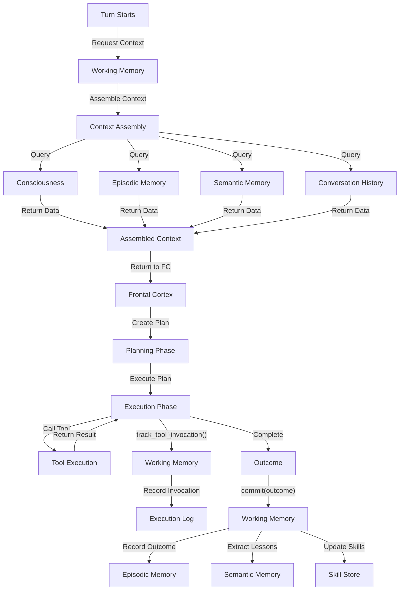

# Working Memory ↔ Frontal Cortex Integration

**Status:** Specification v1.0  
**Last Updated:** 2025-11-05  
**Priority:** HIGH (Core Planning Loop)

## Overview

This integration defines how Working Memory and Frontal Cortex work together: WM assembles context for planning, FC executes plans, WM tracks execution, and WM records outcomes for learning.

### Key Concepts

- **Context Assembly**: WM gathers relevant information for planning
- **Plan Execution**: FC executes plan using tools and daemons
- **Execution Tracking**: WM records what happened during execution
- **Outcome Recording**: WM stores results for future learning
- **Feedback Loop**: System improves through recorded outcomes

## Data Flow

### ASCII Diagram

```
Turn starts
  ↓
FC requests context: assemble_context(prompt, budget)
  ↓
WM assembles context from:
  - Consciousness (mandates, capabilities)
  - Episodic memory (past experiences)
  - Semantic memory (skills, facts)
  - Conversation history
  - Scratch page (observations)
  ↓
WM returns context with budget info
  ↓
FC creates plan based on context
  ↓
FC executes plan, calls tools
  ↓
FC calls: track_tool_invocation(tool, params, result)
  ↓
WM records invocation
  ↓
FC completes execution
  ↓
FC calls: commit(outcome, success, feedback)
  ↓
WM records outcome
  ↓
WM extracts lessons learned
  ↓
WM updates episodic/semantic memory
```

### Mermaid Diagram



## API Contracts

### Request: FC Requests Context

```json
{
  "method": "assemble_context",
  "params": {
    "prompt": "answer_weather_query",
    "budget": 2000,
    "constraints": {
      "max_items": 10,
      "min_confidence": 0.7
    }
  }
}
```

### Response: WM Returns Context

```json
{
  "context": {
    "consciousness": {
      "mandates": [
        "Help users make informed decisions",
        "Protect user privacy"
      ],
      "capabilities": ["web_search", "weather_api"]
    },
    "episodic_memory": [
      "User previously asked about Paris weather",
      "User prefers Celsius over Fahrenheit"
    ],
    "semantic_memory": [
      "Weather query skill",
      "Temperature conversion skill"
    ],
    "conversation_history": [
      "User: What's the weather?",
      "Si: I can help with that"
    ],
    "scratch_page": [
      "User interested in Paris"
    ]
  },
  "budget_remaining": 1200,
  "timestamp": "2025-11-05T10:30:00Z"
}
```

### Request: FC Tracks Tool Invocation

```json
{
  "method": "track_tool_invocation",
  "params": {
    "tool": "weather_api",
    "parameters": {
      "location": "Paris",
      "units": "celsius"
    },
    "result": {
      "temperature": 15,
      "condition": "cloudy",
      "humidity": 65
    },
    "execution_time_ms": 234
  }
}
```

### Request: FC Commits Outcome

```json
{
  "method": "commit",
  "params": {
    "outcome": {
      "success": true,
      "result": "Provided weather forecast for Paris",
      "user_satisfaction": "high"
    },
    "feedback": {
      "what_worked": "Weather API provided accurate data",
      "what_could_improve": "Could have included forecast for next 3 days"
    }
  }
}
```

## Decision Points

### 1. Context Assembly Scope
**When:** FC requests context  
**What:** Determine what context to include  
**How:** Analyze prompt and budget  
**Result:** Context assembled within budget

### 2. Budget Allocation
**When:** Assembling context  
**What:** Allocate budget across memory types  
**How:** Prioritize by relevance  
**Result:** Budget allocated, context returned

### 3. Tool Invocation Tracking
**When:** FC calls tool  
**What:** Record what tool was called  
**How:** Store tool name, parameters, result  
**Result:** Invocation recorded

### 4. Outcome Recording
**When:** FC completes execution  
**What:** Record what happened  
**How:** Store outcome and feedback  
**Result:** Outcome recorded for learning

### 5. Lesson Extraction
**When:** Outcome recorded  
**What:** Extract lessons for future use  
**How:** Analyze outcome and feedback  
**Result:** Lessons stored in semantic memory

## Concrete Examples

### Example 1: Standard Planning and Execution

```
User: "What's the weather in Paris?"

Step 1: Context Assembly
  1. FC calls: assemble_context(prompt="weather_query", budget=2000)
  2. WM assembles context:
     - Consciousness: "Help users make informed decisions"
     - Episodic: "User previously asked about Paris"
     - Semantic: "Weather query skill"
     - Conversation: "User asked about weather"
  3. WM returns context with budget_remaining=1200

Step 2: Planning
  1. FC receives context
  2. FC plans: "Call weather_api for Paris"
  3. FC checks against mandates: All satisfied

Step 3: Execution
  1. FC calls weather_api(location="Paris")
  2. FC calls: track_tool_invocation(tool="weather_api", result={...})
  3. WM records invocation

Step 4: Outcome
  1. FC completes execution
  2. FC calls: commit(outcome={success: true, result: "Weather provided"})
  3. WM records outcome
  4. WM extracts lesson: "Weather API is reliable for Paris queries"
  5. WM updates semantic memory with lesson

Step 5: Response
  1. Si responds: "Weather in Paris is 15°C and cloudy"
```

### Example 2: Budget-Constrained Planning

```
User: "What's the weather in Paris, London, and Tokyo?"

Step 1: Context Assembly
  1. FC calls: assemble_context(prompt="multi_city_weather", budget=1000)
  2. WM assembles context:
     - Consciousness: "Help users make informed decisions"
     - Episodic: "User previously asked about Paris" (high priority)
     - Semantic: "Weather query skill"
  3. WM returns context with budget_remaining=400

Step 2: Planning
  1. FC receives context with limited budget
  2. FC plans: "Call weather_api for all 3 cities"
  3. FC checks budget: 400 tokens remaining
  4. FC decides: "Can query all 3 cities within budget"

Step 3: Execution
  1. FC calls weather_api for Paris, London, Tokyo
  2. FC calls: track_tool_invocation() for each call
  3. WM records all invocations
  4. Budget consumed: 600 tokens

Step 4: Outcome
  1. FC completes execution
  2. FC calls: commit(outcome={success: true})
  3. WM records outcome
  4. WM extracts lesson: "Multi-city queries are efficient"
```

### Example 3: Failed Execution with Learning

```
User: "What's the weather in Paris?"

Step 1: Context Assembly
  1. FC calls: assemble_context(prompt="weather_query", budget=2000)
  2. WM returns context

Step 2: Planning
  1. FC plans: "Call weather_api for Paris"

Step 3: Execution
  1. FC calls weather_api(location="Paris")
  2. API returns error: "Rate limit exceeded"
  3. FC calls: track_tool_invocation(result={error: "Rate limit"})
  4. WM records failed invocation

Step 4: Error Handling
  1. FC detects error
  2. FC retries with different approach
  3. FC calls alternative tool: "web_search"
  4. Web search succeeds

Step 5: Outcome
  1. FC completes execution (with fallback)
  2. FC calls: commit(outcome={success: true, feedback: {what_worked: "Web search fallback", what_could_improve: "Implement rate limit handling"}})
  3. WM records outcome
  4. WM extracts lesson: "Weather API has rate limits, use web search as fallback"
  5. WM updates semantic memory with lesson
```

## Error Handling

### Context Assembly Timeout
**What:** Context assembly takes too long  
**How:** Return partial context  
**Recovery:** Retry with simpler query

### Budget Exceeded
**What:** Context exceeds budget  
**How:** Truncate context to fit budget  
**Recovery:** Prioritize most important items

### Tool Invocation Failure
**What:** Tool call fails  
**How:** Record failure, continue execution  
**Recovery:** Try alternative tool or approach

### Outcome Recording Failure
**What:** Outcome recording fails  
**How:** Log error, continue  
**Recovery:** Retry on next turn

## Related Integrations

- **[Working Memory ↔ Consciousness](working-memory-consciousness.md)** - WM queries consciousness during context assembly
- **[Scratch Page ↔ Frontal Cortex](scratch-page-frontal-cortex.md)** - Observations inform context assembly
- **[Tools ↔ Working Memory](tools-working-memory.md)** - Tool outputs ingested into memory
- **[Tools ↔ Scratch Page](tools-scratch-page.md)** - Tool observations added to scratch page
- **[LLM Budget System ↔ Turn Architecture](llm-budget-system-turn.md)** - Budget constraints on context assembly

## Alignment with Si Core Tenants

- **Documentation-as-Code:** Integration fully specified; any implementation can follow the same context assembly and outcome recording logic
- **Tests-First:** Test conditions drive implementation of context assembly, tracking, and learning
- **Modularity:** WM and FC are separate; memory changes don't require FC code changes
- **Technology-Agnosticism:** Uses generic JSON contracts for context and outcomes

## Testing Considerations

### Test Scenario 1: Standard Context Assembly
- **Setup:**
  - FC calls: `assemble_context(prompt="weather_query", budget=2000)`
  - WM has: consciousness mandates, episodic memory, semantic memory, conversation history
- **Expected:** WM returns assembled context within budget
- **Acceptance Criteria:**
  - Context includes all memory types
  - Budget_remaining is accurate
  - Response time < 200ms
  - Context is relevant to prompt
- **Verification Steps:**
  1. Verify context.consciousness is non-empty
  2. Verify context.episodic_memory is non-empty
  3. Verify context.semantic_memory is non-empty
  4. Verify context.conversation_history is non-empty
  5. Verify context.budget_remaining = 2000 - consumed
  6. Verify Turn Trace logs context assembly
- **Edge Cases:**
  - Empty memory stores
  - Very large memory stores
  - Budget exactly consumed

### Test Scenario 2: Budget-Constrained Context Assembly
- **Setup:**
  - FC calls: `assemble_context(prompt="multi_city_weather", budget=1000)`
  - WM needs 1500 tokens for full context
- **Expected:** Context assembled within budget
- **Acceptance Criteria:**
  - Context size <= 1000 tokens
  - Budget_remaining >= 0
  - Essential information included
  - Non-essential information excluded
- **Verification Steps:**
  1. Verify context size <= 1000 tokens
  2. Verify budget_remaining >= 0
  3. Verify essential mandates present
  4. Verify non-essential items excluded
  5. Verify Turn Trace logs budget constraints
  6. Verify context quality acceptable
- **Edge Cases:**
  - Budget exactly consumed
  - Budget exceeded (error case)
  - Budget with no room for mandates

### Test Scenario 3: Tool Invocation Tracking
- **Setup:**
  - FC calls tool: `weather_api(location="Paris")`
  - FC calls: `track_tool_invocation(tool="weather_api", parameters={location: "Paris"}, result={temperature: 15})`
- **Expected:** Invocation recorded in execution log
- **Acceptance Criteria:**
  - Invocation stored with all details
  - Tool name, parameters, result recorded
  - Execution time tracked
  - Invocation queryable
- **Verification Steps:**
  1. Verify invocation.tool equals "weather_api"
  2. Verify invocation.parameters.location equals "Paris"
  3. Verify invocation.result.temperature equals 15
  4. Verify invocation.execution_time_ms is present
  5. Verify invocation appears in execution log
  6. Verify Turn Trace logs invocation
- **Edge Cases:**
  - Tool with no parameters
  - Tool with large result
  - Multiple invocations of same tool

### Test Scenario 4: Outcome Recording
- **Setup:**
  - FC completes execution
  - FC calls: `commit(outcome={success: true, result: "Weather provided"}, feedback={what_worked: "API reliable"})`
- **Expected:** Outcome recorded in episodic memory
- **Acceptance Criteria:**
  - Outcome stored with all details
  - Success status recorded
  - Feedback captured
  - Outcome queryable
- **Verification Steps:**
  1. Verify outcome.success equals true
  2. Verify outcome.result is non-empty
  3. Verify outcome.feedback.what_worked is present
  4. Verify outcome.timestamp is recent
  5. Verify outcome appears in episodic memory
  6. Verify Turn Trace logs outcome
- **Edge Cases:**
  - Outcome with no feedback
  - Outcome with failure status
  - Outcome with conflicting feedback

### Test Scenario 5: Lesson Extraction
- **Setup:**
  - Outcome recorded: `{success: true, feedback: {what_worked: "Weather API is reliable"}}`
  - WM extracts lessons
- **Expected:** Lessons extracted and stored in semantic memory
- **Acceptance Criteria:**
  - Lesson extracted from feedback
  - Lesson stored in semantic memory
  - Lesson is generalizable
  - Lesson can be queried
- **Verification Steps:**
  1. Verify lesson extracted from feedback
  2. Verify lesson content is non-empty
  3. Verify lesson stored in semantic memory
  4. Verify lesson tagged appropriately
  5. Verify lesson queryable by tag
  6. Verify Turn Trace logs lesson extraction
- **Edge Cases:**
  - Outcome with no extractable lessons
  - Outcome with conflicting lessons
  - Lesson extraction failure

### Test Scenario 6: Failed Execution Recording
- **Setup:**
  - FC calls tool: `weather_api(location="Paris")`
  - Tool fails: `{error: "Rate limit exceeded"}`
  - FC calls: `track_tool_invocation(tool="weather_api", result={error: "Rate limit exceeded"})`
- **Expected:** Failure recorded in execution log
- **Acceptance Criteria:**
  - Failure recorded with error details
  - Error message captured
  - Failure queryable
  - System continues after failure
- **Verification Steps:**
  1. Verify invocation.result.error is present
  2. Verify error message is non-empty
  3. Verify invocation.status equals "failed"
  4. Verify invocation appears in execution log
  5. Verify Turn Trace logs failure
  6. Verify system continues execution
- **Edge Cases:**
  - Tool timeout
  - Tool returns invalid response
  - Multiple tool failures

### Test Scenario 7: Memory Consistency
- **Setup:**
  - Execute multiple tools
  - Record multiple outcomes
  - Query memory
- **Expected:** Memory remains consistent
- **Acceptance Criteria:**
  - All invocations recorded
  - All outcomes recorded
  - No data loss
  - Queries return consistent results
- **Verification Steps:**
  1. Verify all invocations recorded
  2. Verify all outcomes recorded
  3. Verify no duplicate records
  4. Verify query results consistent
  5. Verify Turn Trace logs all operations
  6. Verify memory integrity maintained
- **Edge Cases:**
  - Concurrent operations
  - Memory storage failure
  - Query during active recording

